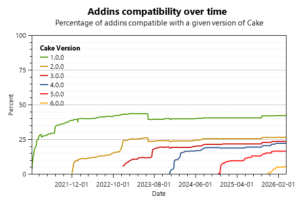

# Audit Report

This report was generated by Cake.AddinDiscoverer 5.11.0 on Tuesday, November 28, 2023 at 12:57:28 AM GMT

## Overall statistics

- The analysis discovered 360 distinct nuget packages.
- If you count all the versions of these addins, there's a grand total of 4413 packages on NuGet.org

## Statistics

- Of the 360 audited nuget packages:
  - 303 are addins
  - 11 are modules
  - 18 are recipes
  - 19 are marked as deprecated
  - 9 could not be audied (see the 'Exceptions' section)
- Of the 332 successfully analyzed packages:
  - 28 are using the cake-contrib icon on the rawgit CDN (which has been shutdown since October 2019)
  - 101 are using the cake-contrib icon on the jsDelivr CDN (which was our preferred CDN to replace rawgit)
  - 54 are using a custom icon hosted on a web site
  - 30 are embedding the cake-contrib icon (which is the current recommendation)
  - 63 are embedding one of the "fancy" cake-contrib icons (which is also recommended)
  - 9 are embedding a custom icon
  - 181 have been transferred to the cake-contrib organization
  - 212 have replaced the obsolete `licenseUrl` with proper license metadata (see the `Additional audit results` section below for details)

## Reports

- Click [here](Audit_for_recipes.md) to view the report for NuGet packages containing recipes.
- Click [here](Audit_for_Cake_1.0.0.md) to view the report for Cake 1.0.0.
- Click [here](Audit_for_Cake_2.0.0.md) to view the report for Cake 2.0.0.
- Click [here](Audit_for_Cake_3.0.0.md) to view the report for Cake 3.0.0.
- Click [here](Audit_for_Cake_4.0.0.md) to view the report for Cake 4.0.0.

## Additional audit results

Due to space constraints we couldn't fit all audit information in this report so we generated an Excel spreadsheet with the following additional information:

- The `NuGet package version` column indicates the version of the package that was audited.
- The `Maintainer` column indicates who is maintaining the source for this project
- The `Icon` column indicates if the nuget package for your addin uses the cake-contrib icon.
- The `Transferred to cake-contrib` column indicates if the project has been moved to the cake-contrib github organization.
- The `License` column indicates the license selected by the addin author. PLEASE NOTE: this information is only available if the nuget package includes the new `license` metadata information (documented [here](https://docs.microsoft.com/en-us/nuget/reference/nuspec#license) and [here](https://docs.microsoft.com/en-us/nuget/reference/msbuild-targets#packing-a-license-expression-or-a-license-file)) as opposed to the [obsolete](https://github.com/NuGet/Announcements/issues/32) `licenseUrl`.
- The `Repository` column indicates if the repository information is present in the package nuspec as documented [here](https://docs.microsoft.com/en-us/nuget/reference/nuspec#repository) and [here](https://docs.microsoft.com/en-us/nuget/reference/msbuild-targets#pack-target).
- The `cake-contrib co-owner` column indicates if the cake-contrib user is a co-owner of the nuget package.
- The `Issues count` column indicates the number of open issues in the addin's github repository.
- The `Pull requests count` column indicates the number of open pull requests in the addin's github repository.
- The `Cake.Recipe` column indicates what version of Cake.Recipe is used to build this addin.
- The `Newtonsoft.Json` column indicates what version of Newtonsoft.Json is referenced by this addin (if any).
- The `Symbols` column indicates whether we found debugging symbols in the NuGet package, in the symbols package or embedded in the DLL.
- The `SourceLink` column indicates whether the SourceLink has been configured.
- The `XML Documentation` column indicates whether XML documentation is included in the nuget package.
- The `Alias Categories` column indicates the alias categories found in the addin assembly.

Click [here](Audit.xlsx) to download the Excel spreadsheet.

## Progress

The following graph shows the percentage of addins that are compatible with Cake over time. For the purpose of this graph, we consider an addin to be compatible with a given version of Cake if it references the desired version of Cake.Core and Cake.Common.
Please note that AddinDiscover 1.0.0 through 4.x.x made assumptions regarding Addins compatibility with prior versions of Cake. However, AddinDiscoverer version 5.0 (which was released on June 15 2023) is much more accurate due to the fact that all historical packages of all addins are analyzed as opposed to analyzing only the latest version of each given addin. This explains why you can observe a change in the number of Addins compatible with Cake 1 and Cake 2 in the graph below starting on June 15 2023:

## Exceptions

**Cake.7zip**: AnalyzeNugetMetadata: Could not find type 'System.Runtime.CompilerServices.NullableContextAttribute' in assembly 'C:\projects\cake-addindiscoverer\artifacts\Publish\System.Runtime.dll'.

**Cake.AsciiDoctorJ**: AnalyzeNugetMetadata: Could not find type 'System.Runtime.CompilerServices.NullableContextAttribute' in assembly 'C:\projects\cake-addindiscoverer\artifacts\Publish\System.Runtime.dll'.

**Cake.Bridge.DependencyInjection**: AnalyzeNugetMetadata: This addin does not contain any decorated method.

**Cake.Build.Helper**: AnalyzeNugetMetadata: This addin does not contain any decorated method.

**Cake.Console**: AnalyzeNugetMetadata: This addin does not contain any decorated method.

**Cake.GitHub.Endpoints**: AnalyzeNugetMetadata: This addin does not contain any decorated method.

**Cake.Issues.Testing**: AnalyzeNugetMetadata: This addin does not contain any decorated method.

**Cake.Sprinkles.Module**: AnalyzeNugetMetadata: Unable to find .\CakeSprinklesIcon.png in the package

**Cake.Testing.Xunit**: AnalyzeNugetMetadata: This addin does not contain any decorated method.

## Deprecated

**Cake.CodeAnalysisReporting**: This addin is no longer maintained

Please use [Cake.Issues](https://github.com/cake-contrib/Cake.Issues), [Cake.Issues.Reporting](https://github.com/cake-contrib/Cake.Issues.Reporting) and
[Cake.Issues.Reporting.Generic](https://github.com/cake-contrib/Cake.Issues.Reporting.Generic) instead.

The Code Analysis Reporting Addin for Cake allows you to generate reports from issue found using any code analyzer or linter.

**Cake.EntityFramework**: This addin is no longer maintained.

**Cake.Extensions**: This package has been renamed to Cake.Incubator

**Cake.Issues.PullRequests.Tfs**: This package has been deprecated for the following reason: Legacy

**Cake.MobileCenter**: MobileCenter Addin for Cake Build, Test and Deployment Automation System. Microsoft deprecated Mobile Center and moved it to App Center.
    This addin is in maintenance mode, further developement will be done on Cake.AppCenter

**Cake.OctoVariapus**: This package has been deprecated for the following reason: Legacy

**Cake.Prca**: This addin is no longer maintained. Please use Cake.Issues and Cake.Issues.PullRequests instead.

The Pull Request Code Analysis Addin for Cake allows you to write issue found using any code analyzer or linter as comments to pull requests.

**Cake.Prca.Issues.DocFx**: This addin is no longer maintained. Please use Cake.Issues.DocFx instead. 

The DocFx support for the Pull Request Code Analysis Addin for Cake allows you to write any warnings logged by DocFx as comments to a pull request.

**Cake.Prca.Issues.EsLint**: This addin is no longer maintained. Please use Cake.Issues.EsLint instead. 

The ESLint support for the Pull Request Code Analysis Addin for Cake allows you to write any issues logged by ESLint as comments to a pull request.

**Cake.Prca.Issues.InspectCode**: This addin is no longer maintained. Please use Cake.Issues.InspectCode instead. 

The Inspect Code support for the Pull Request Code Analysis Addin for Cake allows you to write any issues logged by JetBrains Inspect Code as comments to a pull request.

**Cake.Prca.Issues.Markdownlint**: This addin is no longer maintained. Please use Cake.Issues.Markdownlint instead. 

The Markdownlint support for the Pull Request Code Analysis Addin for Cake allows you to write any issues logged by Markdownlint as comments to a pull request.

**Cake.Prca.Issues.MsBuild**: This addin is no longer maintained. Please use Cake.Issues.MsBuild instead. 

The MsBuild support for the Pull Request Code Analysis Addin for Cake allows you to write any issues logged as warnings in a MsBuild log as comments to a pull request.

**Cake.Prca.PullRequests.Tfs**: This addin is no longer maintained. Please use Cake.Issues.PullRequests.Tfs instead. 

The TFS / VSTS support for the Pull Request Code Analysis Addin for Cake allows you to write found issues as comments to Team Foundation Server or Visual Studio Team Services pull requests.

**Cake.SemVer.FromAssembly**: NOTE: This package has been deprecated.  Please use Cake.SynVer instead.

Cake addin in order to be able to get next semver version of nuget package based on changes to the public API

**Cake.SemVer.FromBinary**: NOTE: This package has been deprecated.  Please use Cake.SynVer instead.
    
Cake addin in order to be able to get next semver version of nuget package based on changes to the public API

**Cake.SimpleVersion**: See https://simpleversion.kieranties.com/articles/intro.html#usage-in-cake

**Cake.Tfs**: This package has been deprecated for the following reason: Legacy

**Cake.XmlHelper**: This package has been deprecated for the following reason: LegacyAnalyzeNugetMetadata: This addin does not contain any decorated method.

**Cake.Xrm.XrmDefinitelyTyped**: Deprecated due to Microsoft.PowerApps.CLI being released. This package no longer being maintained.
