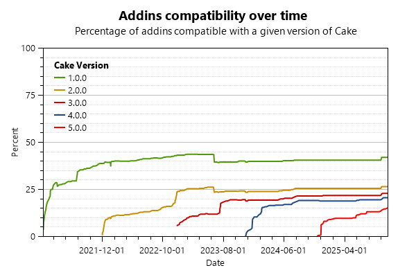

# Information

- This report was generated by Cake.AddinDiscoverer 3.54.0 on Thursday, November 19, 2020 at 4:01:13 PM GMT

# Statistics

- The analysis discovered 335 NuGet packages
  - 9 addins
  - 17 recipes
  - 4 modules
  - 305 uncategorized (see the 'Exceptions' section)
- Of the 30 categorized packages:
  - 28 were successfully audited
  - 2 were marked as deprecated
  - 0 could not be audited (see the 'Exceptions' section)

- Of the 28 audited addins:
  - 12 are using the cake-contrib icon on the rawgit CDN (which will be shutdown in October 2019)
  - 1 are using the cake-contrib icon on the jsDelivr CDN (which was our preferred CDN to replace rawgit)
  - 6 are using a custom icon hosted on a web site
  - 4 are embedding the cake-contrib icon (which is the current recommendation)
  - 1 are embedding a custom icon
  - 8 have been transferred to the cake-contrib organization
  - 15 have replaced the obsolete `licenseUrl` with proper license metadata (see the `Additional audit results` section below for details)

# Reports

- Click [here](Audit_for_recipes.md) to view the report for NuGet packages containing recipes.
- Click [here](Audit_for_Cake_0.33.0.md) to view the report for Cake 0.33.0.
- Click [here](Audit_for_Cake_0.28.0.md) to view the report for Cake 0.28.0.
- Click [here](Audit_for_Cake_0.26.0.md) to view the report for Cake 0.26.0.

# Additional audit results

Due to space constraints we couldn't fit all audit information in this report so we generated an Excel spreadsheet that contains the following additional information:
- The `NuGet package version` column indicates the version of the package that was audited.
- The `Maintainer` column indicates who is maintaining the source for this project
- The `Icon` column indicates if the nuget package for your addin uses the cake-contrib icon.
- The `Transferred to cake-contrib` column indicates if the project has been moved to the cake-contrib github organization.
- The `License` column indicates the license selected by the addin author. PLEASE NOTE: this information is only available if the nuget package includes the new `license` metadata information (documented [here](https://docs.microsoft.com/en-us/nuget/reference/nuspec#license) and [here](https://docs.microsoft.com/en-us/nuget/reference/msbuild-targets#packing-a-license-expression-or-a-license-file)) as opposed to the [obsolete](https://github.com/NuGet/Announcements/issues/32) `licenseUrl`.
- The `Repository` column indicates if the repository information is present in the package nuspec as documented [here](https://docs.microsoft.com/en-us/nuget/reference/nuspec#repository) and [here](https://docs.microsoft.com/en-us/nuget/reference/msbuild-targets#pack-target).
- The `cake-contrib co-owner` column indicates if the cake-contrib user is a co-owner of the nuget package.
- The `Issues count` column indicates the number of open issues in the addin's github repository.
- The `Pull requests count` column indicates the number of open pull requests in the addin's github repository.
- The `Cake.Recipe` column indicates what version of Cake.Recipe is used to build this addin.
- The `Newtonsoft.Json` column indicates what version of Newtonsoft.Json is referenced by this addin (if any).
- The `Symbols` column indicates whether we found debugging symbols in the NuGet package, in the symbols package or embedded in the DLL.
- The `SourceLink` column indicates whether the SourceLink has been configured.
- The `XML Documentation` column indicates whether XML documentation is included in the nuget package.

Click [here](Audit.xlsx) to download the Excel spreadsheet.

# Progress

The following graph shows the percentage of addins that are compatible with Cake over time. For the purpose of this graph, we consider an addin to be compatible with a given version of Cake if it references the desired version of Cake.Core and Cake.Common.

# Exceptions

**Cake.7zip**: AnalyzeNugetMetadata: Could not find assembly 'netstandard, Version=2.0.0.0, Culture=neutral, PublicKeyToken=cc7b13ffcd2ddd51'. Either explicitly load this assembly using a method such as LoadFromAssemblyPath() or use a MetadataAssemblyResolver that returns a valid assembly.

**Cake.ActiveDirectory**: AnalyzeNugetMetadata: Could not find assembly 'mscorlib, Version=4.0.0.0, Culture=neutral, PublicKeyToken=b77a5c561934e089'. Either explicitly load this assembly using a method such as LoadFromAssemblyPath() or use a MetadataAssemblyResolver that returns a valid assembly.

**Cake.Addin3**: AnalyzeNugetMetadata: Could not find assembly 'mscorlib, Version=4.0.0.0, Culture=neutral, PublicKeyToken=b77a5c561934e089'. Either explicitly load this assembly using a method such as LoadFromAssemblyPath() or use a MetadataAssemblyResolver that returns a valid assembly.

**Cake.AliaSql**: AnalyzeNugetMetadata: Could not find assembly 'netstandard, Version=2.0.0.0, Culture=neutral, PublicKeyToken=cc7b13ffcd2ddd51'. Either explicitly load this assembly using a method such as LoadFromAssemblyPath() or use a MetadataAssemblyResolver that returns a valid assembly.

**Cake.Android.Adb**: AnalyzeNugetMetadata: Could not find assembly 'netstandard, Version=2.0.0.0, Culture=neutral, PublicKeyToken=cc7b13ffcd2ddd51'. Either explicitly load this assembly using a method such as LoadFromAssemblyPath() or use a MetadataAssemblyResolver that returns a valid assembly.

**Cake.Android.AvdManager**: AnalyzeNugetMetadata: Could not find assembly 'netstandard, Version=2.0.0.0, Culture=neutral, PublicKeyToken=cc7b13ffcd2ddd51'. Either explicitly load this assembly using a method such as LoadFromAssemblyPath() or use a MetadataAssemblyResolver that returns a valid assembly.

**Cake.Android.SdkManager**: AnalyzeNugetMetadata: Could not find assembly 'netstandard, Version=2.0.0.0, Culture=neutral, PublicKeyToken=cc7b13ffcd2ddd51'. Either explicitly load this assembly using a method such as LoadFromAssemblyPath() or use a MetadataAssemblyResolver that returns a valid assembly.

**Cake.AndroidAppManifest**: AnalyzeNugetMetadata: Could not find assembly 'netstandard, Version=2.0.0.0, Culture=neutral, PublicKeyToken=cc7b13ffcd2ddd51'. Either explicitly load this assembly using a method such as LoadFromAssemblyPath() or use a MetadataAssemblyResolver that returns a valid assembly.

**Cake.Apigee**: AnalyzeNugetMetadata: Could not find assembly 'netstandard, Version=2.0.0.0, Culture=neutral, PublicKeyToken=cc7b13ffcd2ddd51'. Either explicitly load this assembly using a method such as LoadFromAssemblyPath() or use a MetadataAssemblyResolver that returns a valid assembly.

**Cake.ApiReference.Uploader**: AnalyzeNugetMetadata: Could not find assembly 'netstandard, Version=2.0.0.0, Culture=neutral, PublicKeyToken=cc7b13ffcd2ddd51'. Either explicitly load this assembly using a method such as LoadFromAssemblyPath() or use a MetadataAssemblyResolver that returns a valid assembly.

**Cake.AppCenter**: AnalyzeNugetMetadata: Could not find assembly 'netstandard, Version=2.0.0.0, Culture=neutral, PublicKeyToken=cc7b13ffcd2ddd51'. Either explicitly load this assembly using a method such as LoadFromAssemblyPath() or use a MetadataAssemblyResolver that returns a valid assembly.

**Cake.AppleSimulator**: AnalyzeNugetMetadata: Could not find assembly 'netstandard, Version=2.0.0.0, Culture=neutral, PublicKeyToken=cc7b13ffcd2ddd51'. Either explicitly load this assembly using a method such as LoadFromAssemblyPath() or use a MetadataAssemblyResolver that returns a valid assembly.

**Cake.AppPackager**: AnalyzeNugetMetadata: Could not find assembly 'netstandard, Version=2.0.0.0, Culture=neutral, PublicKeyToken=cc7b13ffcd2ddd51'. Either explicitly load this assembly using a method such as LoadFromAssemblyPath() or use a MetadataAssemblyResolver that returns a valid assembly.

**Cake.AppVeyor**: AnalyzeNugetMetadata: Could not find assembly 'netstandard, Version=2.0.0.0, Culture=neutral, PublicKeyToken=cc7b13ffcd2ddd51'. Either explicitly load this assembly using a method such as LoadFromAssemblyPath() or use a MetadataAssemblyResolver that returns a valid assembly.

**Cake.APT.Module**: AnalyzeNugetMetadata: Could not find assembly 'netstandard, Version=2.0.0.0, Culture=neutral, PublicKeyToken=cc7b13ffcd2ddd51'. Either explicitly load this assembly using a method such as LoadFromAssemblyPath() or use a MetadataAssemblyResolver that returns a valid assembly.

**Cake.ArgumentBinder**: AnalyzeNugetMetadata: Could not find assembly 'netstandard, Version=2.0.0.0, Culture=neutral, PublicKeyToken=cc7b13ffcd2ddd51'. Either explicitly load this assembly using a method such as LoadFromAssemblyPath() or use a MetadataAssemblyResolver that returns a valid assembly.

**Cake.ArgumentHelpers**: AnalyzeNugetMetadata: Could not find assembly 'mscorlib, Version=4.0.0.0, Culture=neutral, PublicKeyToken=b77a5c561934e089'. Either explicitly load this assembly using a method such as LoadFromAssemblyPath() or use a MetadataAssemblyResolver that returns a valid assembly.

**Cake.ArtifactDrop**: AnalyzeNugetMetadata: Could not find assembly 'mscorlib, Version=4.0.0.0, Culture=neutral, PublicKeyToken=b77a5c561934e089'. Either explicitly load this assembly using a method such as LoadFromAssemblyPath() or use a MetadataAssemblyResolver that returns a valid assembly.

**Cake.AsciiDoctorJ**: AnalyzeNugetMetadata: Could not find assembly 'netstandard, Version=2.0.0.0, Culture=neutral, PublicKeyToken=cc7b13ffcd2ddd51'. Either explicitly load this assembly using a method such as LoadFromAssemblyPath() or use a MetadataAssemblyResolver that returns a valid assembly.

**Cake.AssemblyInfoReflector**: AnalyzeNugetMetadata: Could not find assembly 'netstandard, Version=2.0.0.0, Culture=neutral, PublicKeyToken=cc7b13ffcd2ddd51'. Either explicitly load this assembly using a method such as LoadFromAssemblyPath() or use a MetadataAssemblyResolver that returns a valid assembly.

**Cake.AutoRest**: AnalyzeNugetMetadata: Could not find assembly 'mscorlib, Version=4.0.0.0, Culture=neutral, PublicKeyToken=b77a5c561934e089'. Either explicitly load this assembly using a method such as LoadFromAssemblyPath() or use a MetadataAssemblyResolver that returns a valid assembly.

**Cake.AWS.CloudFront**: AnalyzeNugetMetadata: Could not find assembly 'netstandard, Version=2.0.0.0, Culture=neutral, PublicKeyToken=cc7b13ffcd2ddd51'. Either explicitly load this assembly using a method such as LoadFromAssemblyPath() or use a MetadataAssemblyResolver that returns a valid assembly.

**Cake.AWS.CodeDeploy**: AnalyzeNugetMetadata: Could not find assembly 'netstandard, Version=2.0.0.0, Culture=neutral, PublicKeyToken=cc7b13ffcd2ddd51'. Either explicitly load this assembly using a method such as LoadFromAssemblyPath() or use a MetadataAssemblyResolver that returns a valid assembly.

**Cake.AWS.EC2**: AnalyzeNugetMetadata: Could not find assembly 'netstandard, Version=2.0.0.0, Culture=neutral, PublicKeyToken=cc7b13ffcd2ddd51'. Either explicitly load this assembly using a method such as LoadFromAssemblyPath() or use a MetadataAssemblyResolver that returns a valid assembly.

**Cake.Aws.ElasticBeanstalk**: AnalyzeNugetMetadata: Could not find assembly 'mscorlib, Version=4.0.0.0, Culture=neutral, PublicKeyToken=b77a5c561934e089'. Either explicitly load this assembly using a method such as LoadFromAssemblyPath() or use a MetadataAssemblyResolver that returns a valid assembly.

**Cake.AWS.ElasticBeanstalkTools**: AnalyzeNugetMetadata: Could not find assembly 'netstandard, Version=2.0.0.0, Culture=neutral, PublicKeyToken=cc7b13ffcd2ddd51'. Either explicitly load this assembly using a method such as LoadFromAssemblyPath() or use a MetadataAssemblyResolver that returns a valid assembly.

**Cake.AWS.ElasticLoadBalancing**: AnalyzeNugetMetadata: Could not find assembly 'netstandard, Version=2.0.0.0, Culture=neutral, PublicKeyToken=cc7b13ffcd2ddd51'. Either explicitly load this assembly using a method such as LoadFromAssemblyPath() or use a MetadataAssemblyResolver that returns a valid assembly.

**Cake.AWS.Lambda**: AnalyzeNugetMetadata: Could not find assembly 'netstandard, Version=2.0.0.0, Culture=neutral, PublicKeyToken=cc7b13ffcd2ddd51'. Either explicitly load this assembly using a method such as LoadFromAssemblyPath() or use a MetadataAssemblyResolver that returns a valid assembly.

**Cake.AWS.Route53**: AnalyzeNugetMetadata: Could not find assembly 'netstandard, Version=2.0.0.0, Culture=neutral, PublicKeyToken=cc7b13ffcd2ddd51'. Either explicitly load this assembly using a method such as LoadFromAssemblyPath() or use a MetadataAssemblyResolver that returns a valid assembly.

**Cake.AWS.S3**: AnalyzeNugetMetadata: Could not find assembly 'netstandard, Version=2.0.0.0, Culture=neutral, PublicKeyToken=cc7b13ffcd2ddd51'. Either explicitly load this assembly using a method such as LoadFromAssemblyPath() or use a MetadataAssemblyResolver that returns a valid assembly.

**Cake.AzCopy**: AnalyzeNugetMetadata: Could not find assembly 'netstandard, Version=2.0.0.0, Culture=neutral, PublicKeyToken=cc7b13ffcd2ddd51'. Either explicitly load this assembly using a method such as LoadFromAssemblyPath() or use a MetadataAssemblyResolver that returns a valid assembly.

**Cake.Azure**: AnalyzeNugetMetadata: Could not find assembly 'netstandard, Version=2.0.0.0, Culture=neutral, PublicKeyToken=cc7b13ffcd2ddd51'. Either explicitly load this assembly using a method such as LoadFromAssemblyPath() or use a MetadataAssemblyResolver that returns a valid assembly.

**Cake.AzureBlobStorage**: AnalyzeNugetMetadata: Could not find assembly 'mscorlib, Version=4.0.0.0, Culture=neutral, PublicKeyToken=b77a5c561934e089'. Either explicitly load this assembly using a method such as LoadFromAssemblyPath() or use a MetadataAssemblyResolver that returns a valid assembly.

**Cake.AzureCli**: AnalyzeNugetMetadata: Could not find assembly 'netstandard, Version=2.0.0.0, Culture=neutral, PublicKeyToken=cc7b13ffcd2ddd51'. Either explicitly load this assembly using a method such as LoadFromAssemblyPath() or use a MetadataAssemblyResolver that returns a valid assembly.

**Cake.AzureDevOps**: AnalyzeNugetMetadata: Could not find assembly 'netstandard, Version=2.0.0.0, Culture=neutral, PublicKeyToken=cc7b13ffcd2ddd51'. Either explicitly load this assembly using a method such as LoadFromAssemblyPath() or use a MetadataAssemblyResolver that returns a valid assembly.

**Cake.AzureStorage**: AnalyzeNugetMetadata: Could not find assembly 'netstandard, Version=2.0.0.0, Culture=neutral, PublicKeyToken=cc7b13ffcd2ddd51'. Either explicitly load this assembly using a method such as LoadFromAssemblyPath() or use a MetadataAssemblyResolver that returns a valid assembly.

**Cake.BenchmarkDotNet**: AnalyzeNugetMetadata: Could not find assembly 'netstandard, Version=2.0.0.0, Culture=neutral, PublicKeyToken=cc7b13ffcd2ddd51'. Either explicitly load this assembly using a method such as LoadFromAssemblyPath() or use a MetadataAssemblyResolver that returns a valid assembly.

**Cake.BitDiffer**: AnalyzeNugetMetadata: Could not find assembly 'netstandard, Version=2.0.0.0, Culture=neutral, PublicKeyToken=cc7b13ffcd2ddd51'. Either explicitly load this assembly using a method such as LoadFromAssemblyPath() or use a MetadataAssemblyResolver that returns a valid assembly.

**Cake.Board.Asana**: AnalyzeNugetMetadata: Could not find assembly 'netstandard, Version=2.0.0.0, Culture=neutral, PublicKeyToken=cc7b13ffcd2ddd51'. Either explicitly load this assembly using a method such as LoadFromAssemblyPath() or use a MetadataAssemblyResolver that returns a valid assembly.

**Cake.Board.AzureBoards**: AnalyzeNugetMetadata: Could not find assembly 'netstandard, Version=2.0.0.0, Culture=neutral, PublicKeyToken=cc7b13ffcd2ddd51'. Either explicitly load this assembly using a method such as LoadFromAssemblyPath() or use a MetadataAssemblyResolver that returns a valid assembly.

**Cake.Boots**: AnalyzeNugetMetadata: Could not find assembly 'netstandard, Version=2.0.0.0, Culture=neutral, PublicKeyToken=cc7b13ffcd2ddd51'. Either explicitly load this assembly using a method such as LoadFromAssemblyPath() or use a MetadataAssemblyResolver that returns a valid assembly.

**Cake.Bower**: AnalyzeNugetMetadata: Could not find assembly 'netstandard, Version=2.0.0.0, Culture=neutral, PublicKeyToken=cc7b13ffcd2ddd51'. Either explicitly load this assembly using a method such as LoadFromAssemblyPath() or use a MetadataAssemblyResolver that returns a valid assembly.

**Cake.BrowserStack**: AnalyzeNugetMetadata: Could not find assembly 'netstandard, Version=2.0.0.0, Culture=neutral, PublicKeyToken=cc7b13ffcd2ddd51'. Either explicitly load this assembly using a method such as LoadFromAssemblyPath() or use a MetadataAssemblyResolver that returns a valid assembly.

**Cake.BuildSystems.Module**: AnalyzeNugetMetadata: Could not find assembly 'netstandard, Version=2.0.0.0, Culture=neutral, PublicKeyToken=cc7b13ffcd2ddd51'. Either explicitly load this assembly using a method such as LoadFromAssemblyPath() or use a MetadataAssemblyResolver that returns a valid assembly.

**Cake.Bumpy**: AnalyzeNugetMetadata: Could not find assembly 'netstandard, Version=2.0.0.0, Culture=neutral, PublicKeyToken=cc7b13ffcd2ddd51'. Either explicitly load this assembly using a method such as LoadFromAssemblyPath() or use a MetadataAssemblyResolver that returns a valid assembly.

**Cake.Buns.ReportPortal**: AnalyzeNugetMetadata: Could not find assembly 'netstandard, Version=2.0.0.0, Culture=neutral, PublicKeyToken=cc7b13ffcd2ddd51'. Either explicitly load this assembly using a method such as LoadFromAssemblyPath() or use a MetadataAssemblyResolver that returns a valid assembly.

**Cake.CachedNpm**: AnalyzeNugetMetadata: Could not find assembly 'mscorlib, Version=4.0.0.0, Culture=neutral, PublicKeyToken=b77a5c561934e089'. Either explicitly load this assembly using a method such as LoadFromAssemblyPath() or use a MetadataAssemblyResolver that returns a valid assembly.

**Cake.CakeBoss**: AnalyzeNugetMetadata: Could not find assembly 'mscorlib, Version=4.0.0.0, Culture=neutral, PublicKeyToken=b77a5c561934e089'. Either explicitly load this assembly using a method such as LoadFromAssemblyPath() or use a MetadataAssemblyResolver that returns a valid assembly.

**Cake.CakeMail**: AnalyzeNugetMetadata: Could not find assembly 'netstandard, Version=2.0.0.0, Culture=neutral, PublicKeyToken=cc7b13ffcd2ddd51'. Either explicitly load this assembly using a method such as LoadFromAssemblyPath() or use a MetadataAssemblyResolver that returns a valid assembly.

**Cake.Chocolatey.Module**: AnalyzeNugetMetadata: Could not find assembly 'netstandard, Version=2.0.0.0, Culture=neutral, PublicKeyToken=cc7b13ffcd2ddd51'. Either explicitly load this assembly using a method such as LoadFromAssemblyPath() or use a MetadataAssemblyResolver that returns a valid assembly.

**Cake.Chutzpah**: AnalyzeNugetMetadata: Could not find assembly 'netstandard, Version=2.0.0.0, Culture=neutral, PublicKeyToken=cc7b13ffcd2ddd51'. Either explicitly load this assembly using a method such as LoadFromAssemblyPath() or use a MetadataAssemblyResolver that returns a valid assembly.

**Cake.CK.Pack**: AnalyzeNugetMetadata: Could not find assembly 'netstandard, Version=2.0.0.0, Culture=neutral, PublicKeyToken=cc7b13ffcd2ddd51'. Either explicitly load this assembly using a method such as LoadFromAssemblyPath() or use a MetadataAssemblyResolver that returns a valid assembly.

**Cake.ClickTwice**: AnalyzeNugetMetadata: Could not find assembly 'mscorlib, Version=4.0.0.0, Culture=neutral, PublicKeyToken=b77a5c561934e089'. Either explicitly load this assembly using a method such as LoadFromAssemblyPath() or use a MetadataAssemblyResolver that returns a valid assembly.

**Cake.CMake**: AnalyzeNugetMetadata: Could not find assembly 'netstandard, Version=2.0.0.0, Culture=neutral, PublicKeyToken=cc7b13ffcd2ddd51'. Either explicitly load this assembly using a method such as LoadFromAssemblyPath() or use a MetadataAssemblyResolver that returns a valid assembly.

**Cake.CodeAnalysisReporting**: This addin is no longer maintained

Please use [Cake.Issues](https://github.com/cake-contrib/Cake.Issues), [Cake.Issues.Reporting](https://github.com/cake-contrib/Cake.Issues.Reporting) and
[Cake.Issues.Reporting.Generic](https://github.com/cake-contrib/Cake.Issues.Reporting.Generic) instead.

The Code Analysis Reporting Addin for Cake allows you to generate reports from issue found using any code analyzer or linter.AnalyzeNugetMetadata: Could not find assembly 'mscorlib, Version=4.0.0.0, Culture=neutral, PublicKeyToken=b77a5c561934e089'. Either explicitly load this assembly using a method such as LoadFromAssemblyPath() or use a MetadataAssemblyResolver that returns a valid assembly.

**Cake.Codecov**: AnalyzeNugetMetadata: Could not find assembly 'netstandard, Version=2.0.0.0, Culture=neutral, PublicKeyToken=cc7b13ffcd2ddd51'. Either explicitly load this assembly using a method such as LoadFromAssemblyPath() or use a MetadataAssemblyResolver that returns a valid assembly.

**Cake.CodeGen.NSwag**: AnalyzeNugetMetadata: Could not find assembly 'netstandard, Version=2.0.0.0, Culture=neutral, PublicKeyToken=cc7b13ffcd2ddd51'. Either explicitly load this assembly using a method such as LoadFromAssemblyPath() or use a MetadataAssemblyResolver that returns a valid assembly.

**Cake.CodeGen.OpenAPI**: AnalyzeNugetMetadata: Could not find assembly 'netstandard, Version=2.0.0.0, Culture=neutral, PublicKeyToken=cc7b13ffcd2ddd51'. Either explicitly load this assembly using a method such as LoadFromAssemblyPath() or use a MetadataAssemblyResolver that returns a valid assembly.

**Cake.Compression**: AnalyzeNugetMetadata: Could not find assembly 'netstandard, Version=2.0.0.0, Culture=neutral, PublicKeyToken=cc7b13ffcd2ddd51'. Either explicitly load this assembly using a method such as LoadFromAssemblyPath() or use a MetadataAssemblyResolver that returns a valid assembly.

**Cake.ConventionalChangelog**: AnalyzeNugetMetadata: Could not find assembly 'netstandard, Version=2.0.0.0, Culture=neutral, PublicKeyToken=cc7b13ffcd2ddd51'. Either explicitly load this assembly using a method such as LoadFromAssemblyPath() or use a MetadataAssemblyResolver that returns a valid assembly.

**Cake.CoverageComparer**: AnalyzeNugetMetadata: Could not find assembly 'netstandard, Version=2.0.0.0, Culture=neutral, PublicKeyToken=cc7b13ffcd2ddd51'. Either explicitly load this assembly using a method such as LoadFromAssemblyPath() or use a MetadataAssemblyResolver that returns a valid assembly.

**Cake.Coveralls**: AnalyzeNugetMetadata: Could not find assembly 'netstandard, Version=2.0.0.0, Culture=neutral, PublicKeyToken=cc7b13ffcd2ddd51'. Either explicitly load this assembly using a method such as LoadFromAssemblyPath() or use a MetadataAssemblyResolver that returns a valid assembly.

**Cake.Coverlet**: AnalyzeNugetMetadata: Could not find assembly 'netstandard, Version=2.0.0.0, Culture=neutral, PublicKeyToken=cc7b13ffcd2ddd51'. Either explicitly load this assembly using a method such as LoadFromAssemblyPath() or use a MetadataAssemblyResolver that returns a valid assembly.

**Cake.CsvHelper**: AnalyzeNugetMetadata: Could not find assembly 'mscorlib, Version=4.0.0.0, Culture=neutral, PublicKeyToken=b77a5c561934e089'. Either explicitly load this assembly using a method such as LoadFromAssemblyPath() or use a MetadataAssemblyResolver that returns a valid assembly.

**Cake.Curl**: AnalyzeNugetMetadata: Could not find assembly 'netstandard, Version=2.0.0.0, Culture=neutral, PublicKeyToken=cc7b13ffcd2ddd51'. Either explicitly load this assembly using a method such as LoadFromAssemblyPath() or use a MetadataAssemblyResolver that returns a valid assembly.

**Cake.Dart**: AnalyzeNugetMetadata: Could not find assembly 'netstandard, Version=2.0.0.0, Culture=neutral, PublicKeyToken=cc7b13ffcd2ddd51'. Either explicitly load this assembly using a method such as LoadFromAssemblyPath() or use a MetadataAssemblyResolver that returns a valid assembly.

**Cake.Debootstrap**: AnalyzeNugetMetadata: Could not find assembly 'mscorlib, Version=4.0.0.0, Culture=neutral, PublicKeyToken=b77a5c561934e089'. Either explicitly load this assembly using a method such as LoadFromAssemblyPath() or use a MetadataAssemblyResolver that returns a valid assembly.

**Cake.DependenciesAnalyser**: AnalyzeNugetMetadata: Could not find assembly 'netstandard, Version=2.0.0.0, Culture=neutral, PublicKeyToken=cc7b13ffcd2ddd51'. Either explicitly load this assembly using a method such as LoadFromAssemblyPath() or use a MetadataAssemblyResolver that returns a valid assembly.

**Cake.Deploy.Azure.Authentication**: AnalyzeNugetMetadata: Could not find assembly 'mscorlib, Version=4.0.0.0, Culture=neutral, PublicKeyToken=b77a5c561934e089'. Either explicitly load this assembly using a method such as LoadFromAssemblyPath() or use a MetadataAssemblyResolver that returns a valid assembly.

**Cake.Deploy.Azure.Management.WebSites**: AnalyzeNugetMetadata: Could not find assembly 'mscorlib, Version=4.0.0.0, Culture=neutral, PublicKeyToken=b77a5c561934e089'. Either explicitly load this assembly using a method such as LoadFromAssemblyPath() or use a MetadataAssemblyResolver that returns a valid assembly.

**Cake.Deploy.Azure.ResourceManager**: AnalyzeNugetMetadata: Could not find assembly 'mscorlib, Version=4.0.0.0, Culture=neutral, PublicKeyToken=b77a5c561934e089'. Either explicitly load this assembly using a method such as LoadFromAssemblyPath() or use a MetadataAssemblyResolver that returns a valid assembly.

**Cake.Deploy.Bot.LUIS**: AnalyzeNugetMetadata: Could not find assembly 'mscorlib, Version=4.0.0.0, Culture=neutral, PublicKeyToken=b77a5c561934e089'. Either explicitly load this assembly using a method such as LoadFromAssemblyPath() or use a MetadataAssemblyResolver that returns a valid assembly.

**Cake.Deploy.Variables**: AnalyzeNugetMetadata: Could not find assembly 'netstandard, Version=2.0.0.0, Culture=neutral, PublicKeyToken=cc7b13ffcd2ddd51'. Either explicitly load this assembly using a method such as LoadFromAssemblyPath() or use a MetadataAssemblyResolver that returns a valid assembly.

**Cake.DeployParams**: AnalyzeNugetMetadata: Could not find assembly 'mscorlib, Version=4.0.0.0, Culture=neutral, PublicKeyToken=b77a5c561934e089'. Either explicitly load this assembly using a method such as LoadFromAssemblyPath() or use a MetadataAssemblyResolver that returns a valid assembly.

**Cake.Dialog**: AnalyzeNugetMetadata: Could not find assembly 'mscorlib, Version=4.0.0.0, Culture=neutral, PublicKeyToken=b77a5c561934e089'. Either explicitly load this assembly using a method such as LoadFromAssemblyPath() or use a MetadataAssemblyResolver that returns a valid assembly.

**Cake.Discord**: AnalyzeNugetMetadata: Could not find assembly 'mscorlib, Version=4.0.0.0, Culture=neutral, PublicKeyToken=b77a5c561934e089'. Either explicitly load this assembly using a method such as LoadFromAssemblyPath() or use a MetadataAssemblyResolver that returns a valid assembly.

**Cake.DocCreator**: AnalyzeNugetMetadata: Could not find assembly 'mscorlib, Version=4.0.0.0, Culture=neutral, PublicKeyToken=b77a5c561934e089'. Either explicitly load this assembly using a method such as LoadFromAssemblyPath() or use a MetadataAssemblyResolver that returns a valid assembly.

**Cake.DocFx**: AnalyzeNugetMetadata: Could not find assembly 'netstandard, Version=2.0.0.0, Culture=neutral, PublicKeyToken=cc7b13ffcd2ddd51'. Either explicitly load this assembly using a method such as LoadFromAssemblyPath() or use a MetadataAssemblyResolver that returns a valid assembly.

**Cake.Docker**: AnalyzeNugetMetadata: Could not find assembly 'netstandard, Version=2.0.0.0, Culture=neutral, PublicKeyToken=cc7b13ffcd2ddd51'. Either explicitly load this assembly using a method such as LoadFromAssemblyPath() or use a MetadataAssemblyResolver that returns a valid assembly.

**Cake.DocumentDb**: AnalyzeNugetMetadata: Could not find assembly 'mscorlib, Version=4.0.0.0, Culture=neutral, PublicKeyToken=b77a5c561934e089'. Either explicitly load this assembly using a method such as LoadFromAssemblyPath() or use a MetadataAssemblyResolver that returns a valid assembly.

**Cake.DoInDirectory**: AnalyzeNugetMetadata: Could not find assembly 'netstandard, Version=2.0.0.0, Culture=neutral, PublicKeyToken=cc7b13ffcd2ddd51'. Either explicitly load this assembly using a method such as LoadFromAssemblyPath() or use a MetadataAssemblyResolver that returns a valid assembly.

**Cake.DotNetCoreEf**: AnalyzeNugetMetadata: Could not find assembly 'netstandard, Version=2.0.0.0, Culture=neutral, PublicKeyToken=cc7b13ffcd2ddd51'. Either explicitly load this assembly using a method such as LoadFromAssemblyPath() or use a MetadataAssemblyResolver that returns a valid assembly.

**Cake.DotNetCoreGlobalTool**: AnalyzeNugetMetadata: Could not find assembly 'netstandard, Version=2.0.0.0, Culture=neutral, PublicKeyToken=cc7b13ffcd2ddd51'. Either explicitly load this assembly using a method such as LoadFromAssemblyPath() or use a MetadataAssemblyResolver that returns a valid assembly.

**Cake.DotNetTool.Module**: AnalyzeNugetMetadata: Could not find assembly 'netstandard, Version=2.0.0.0, Culture=neutral, PublicKeyToken=cc7b13ffcd2ddd51'. Either explicitly load this assembly using a method such as LoadFromAssemblyPath() or use a MetadataAssemblyResolver that returns a valid assembly.

**Cake.DotNetVersionDetector**: AnalyzeNugetMetadata: Could not find assembly 'netstandard, Version=2.0.0.0, Culture=neutral, PublicKeyToken=cc7b13ffcd2ddd51'. Either explicitly load this assembly using a method such as LoadFromAssemblyPath() or use a MetadataAssemblyResolver that returns a valid assembly.

**Cake.Eazfuscator.Net**: AnalyzeNugetMetadata: Could not find assembly 'netstandard, Version=2.0.0.0, Culture=neutral, PublicKeyToken=cc7b13ffcd2ddd51'. Either explicitly load this assembly using a method such as LoadFromAssemblyPath() or use a MetadataAssemblyResolver that returns a valid assembly.

**Cake.Electron.Net**: AnalyzeNugetMetadata: Could not find assembly 'netstandard, Version=2.0.0.0, Culture=neutral, PublicKeyToken=cc7b13ffcd2ddd51'. Either explicitly load this assembly using a method such as LoadFromAssemblyPath() or use a MetadataAssemblyResolver that returns a valid assembly.

**Cake.Email**: AnalyzeNugetMetadata: Could not find assembly 'netstandard, Version=2.0.0.0, Culture=neutral, PublicKeyToken=cc7b13ffcd2ddd51'. Either explicitly load this assembly using a method such as LoadFromAssemblyPath() or use a MetadataAssemblyResolver that returns a valid assembly.

**Cake.Ember**: AnalyzeNugetMetadata: Could not find assembly 'netstandard, Version=2.0.0.0, Culture=neutral, PublicKeyToken=cc7b13ffcd2ddd51'. Either explicitly load this assembly using a method such as LoadFromAssemblyPath() or use a MetadataAssemblyResolver that returns a valid assembly.

**Cake.Endpoint**: AnalyzeNugetMetadata: Could not find assembly 'netstandard, Version=2.0.0.0, Culture=neutral, PublicKeyToken=cc7b13ffcd2ddd51'. Either explicitly load this assembly using a method such as LoadFromAssemblyPath() or use a MetadataAssemblyResolver that returns a valid assembly.

**Cake.EntityFramework**: AnalyzeNugetMetadata: Could not find assembly 'mscorlib, Version=4.0.0.0, Culture=neutral, PublicKeyToken=b77a5c561934e089'. Either explicitly load this assembly using a method such as LoadFromAssemblyPath() or use a MetadataAssemblyResolver that returns a valid assembly.

**Cake.EntityFramework6**: AnalyzeNugetMetadata: Could not find assembly 'netstandard, Version=2.0.0.0, Culture=neutral, PublicKeyToken=cc7b13ffcd2ddd51'. Either explicitly load this assembly using a method such as LoadFromAssemblyPath() or use a MetadataAssemblyResolver that returns a valid assembly.

**Cake.EnvXmlTransform**: AnalyzeNugetMetadata: Could not find assembly 'netstandard, Version=2.0.0.0, Culture=neutral, PublicKeyToken=cc7b13ffcd2ddd51'. Either explicitly load this assembly using a method such as LoadFromAssemblyPath() or use a MetadataAssemblyResolver that returns a valid assembly.

**Cake.ExtendedNuGet**: AnalyzeNugetMetadata: Could not find assembly 'netstandard, Version=2.0.0.0, Culture=neutral, PublicKeyToken=cc7b13ffcd2ddd51'. Either explicitly load this assembly using a method such as LoadFromAssemblyPath() or use a MetadataAssemblyResolver that returns a valid assembly.

**Cake.Fastlane**: AnalyzeNugetMetadata: Could not find assembly 'netstandard, Version=2.0.0.0, Culture=neutral, PublicKeyToken=cc7b13ffcd2ddd51'. Either explicitly load this assembly using a method such as LoadFromAssemblyPath() or use a MetadataAssemblyResolver that returns a valid assembly.

**Cake.Figlet**: AnalyzeNugetMetadata: Could not find assembly 'netstandard, Version=2.0.0.0, Culture=neutral, PublicKeyToken=cc7b13ffcd2ddd51'. Either explicitly load this assembly using a method such as LoadFromAssemblyPath() or use a MetadataAssemblyResolver that returns a valid assembly.

**Cake.FileHelpers**: AnalyzeNugetMetadata: Could not find assembly 'netstandard, Version=2.0.0.0, Culture=neutral, PublicKeyToken=cc7b13ffcd2ddd51'. Either explicitly load this assembly using a method such as LoadFromAssemblyPath() or use a MetadataAssemblyResolver that returns a valid assembly.

**Cake.FileSet**: AnalyzeNugetMetadata: Could not find assembly 'netstandard, Version=2.0.0.0, Culture=neutral, PublicKeyToken=cc7b13ffcd2ddd51'. Either explicitly load this assembly using a method such as LoadFromAssemblyPath() or use a MetadataAssemblyResolver that returns a valid assembly.

**Cake.FluentMigrator**: AnalyzeNugetMetadata: Could not find assembly 'mscorlib, Version=4.0.0.0, Culture=neutral, PublicKeyToken=b77a5c561934e089'. Either explicitly load this assembly using a method such as LoadFromAssemblyPath() or use a MetadataAssemblyResolver that returns a valid assembly.

**Cake.Flutter**: AnalyzeNugetMetadata: Could not find assembly 'netstandard, Version=2.0.0.0, Culture=neutral, PublicKeyToken=cc7b13ffcd2ddd51'. Either explicitly load this assembly using a method such as LoadFromAssemblyPath() or use a MetadataAssemblyResolver that returns a valid assembly.

**Cake.Flyway**: AnalyzeNugetMetadata: Could not find assembly 'netstandard, Version=2.0.0.0, Culture=neutral, PublicKeyToken=cc7b13ffcd2ddd51'. Either explicitly load this assembly using a method such as LoadFromAssemblyPath() or use a MetadataAssemblyResolver that returns a valid assembly.

**Cake.Ftp**: AnalyzeNugetMetadata: Could not find assembly 'netstandard, Version=2.0.0.0, Culture=neutral, PublicKeyToken=cc7b13ffcd2ddd51'. Either explicitly load this assembly using a method such as LoadFromAssemblyPath() or use a MetadataAssemblyResolver that returns a valid assembly.

**Cake.FtpDeploy**: AnalyzeNugetMetadata: Could not find assembly 'netstandard, Version=2.0.0.0, Culture=neutral, PublicKeyToken=cc7b13ffcd2ddd51'. Either explicitly load this assembly using a method such as LoadFromAssemblyPath() or use a MetadataAssemblyResolver that returns a valid assembly.

**Cake.FtpFolderUpload**: AnalyzeNugetMetadata: Could not find assembly 'netstandard, Version=2.0.0.0, Culture=neutral, PublicKeyToken=cc7b13ffcd2ddd51'. Either explicitly load this assembly using a method such as LoadFromAssemblyPath() or use a MetadataAssemblyResolver that returns a valid assembly.

**Cake.Gem**: AnalyzeNugetMetadata: Could not find assembly 'netstandard, Version=2.0.0.0, Culture=neutral, PublicKeyToken=cc7b13ffcd2ddd51'. Either explicitly load this assembly using a method such as LoadFromAssemblyPath() or use a MetadataAssemblyResolver that returns a valid assembly.

**Cake.Genymotion**: AnalyzeNugetMetadata: Could not find assembly 'mscorlib, Version=4.0.0.0, Culture=neutral, PublicKeyToken=b77a5c561934e089'. Either explicitly load this assembly using a method such as LoadFromAssemblyPath() or use a MetadataAssemblyResolver that returns a valid assembly.

**Cake.Gerrit**: AnalyzeNugetMetadata: Could not find assembly 'netstandard, Version=2.0.0.0, Culture=neutral, PublicKeyToken=cc7b13ffcd2ddd51'. Either explicitly load this assembly using a method such as LoadFromAssemblyPath() or use a MetadataAssemblyResolver that returns a valid assembly.

**Cake.Git**: AnalyzeNugetMetadata: Could not find assembly 'netstandard, Version=2.0.0.0, Culture=neutral, PublicKeyToken=cc7b13ffcd2ddd51'. Either explicitly load this assembly using a method such as LoadFromAssemblyPath() or use a MetadataAssemblyResolver that returns a valid assembly.

**Cake.GitHub**: AnalyzeNugetMetadata: Could not find assembly 'netstandard, Version=2.0.0.0, Culture=neutral, PublicKeyToken=cc7b13ffcd2ddd51'. Either explicitly load this assembly using a method such as LoadFromAssemblyPath() or use a MetadataAssemblyResolver that returns a valid assembly.

**Cake.GitLabAPICI**: AnalyzeNugetMetadata: Could not find assembly 'netstandard, Version=2.0.0.0, Culture=neutral, PublicKeyToken=cc7b13ffcd2ddd51'. Either explicitly load this assembly using a method such as LoadFromAssemblyPath() or use a MetadataAssemblyResolver that returns a valid assembly.

**Cake.GitPackager**: AnalyzeNugetMetadata: Could not find assembly 'mscorlib, Version=4.0.0.0, Culture=neutral, PublicKeyToken=b77a5c561934e089'. Either explicitly load this assembly using a method such as LoadFromAssemblyPath() or use a MetadataAssemblyResolver that returns a valid assembly.

**Cake.Gitter**: AnalyzeNugetMetadata: Could not find assembly 'netstandard, Version=2.0.0.0, Culture=neutral, PublicKeyToken=cc7b13ffcd2ddd51'. Either explicitly load this assembly using a method such as LoadFromAssemblyPath() or use a MetadataAssemblyResolver that returns a valid assembly.

**Cake.GitVersioning**: AnalyzeNugetMetadata: Could not find assembly 'netstandard, Version=2.0.0.0, Culture=neutral, PublicKeyToken=cc7b13ffcd2ddd51'. Either explicitly load this assembly using a method such as LoadFromAssemblyPath() or use a MetadataAssemblyResolver that returns a valid assembly.

**Cake.Gradle**: AnalyzeNugetMetadata: Could not find assembly 'mscorlib, Version=4.0.0.0, Culture=neutral, PublicKeyToken=b77a5c561934e089'. Either explicitly load this assembly using a method such as LoadFromAssemblyPath() or use a MetadataAssemblyResolver that returns a valid assembly.

**Cake.Graph**: AnalyzeNugetMetadata: Could not find assembly 'netstandard, Version=2.0.0.0, Culture=neutral, PublicKeyToken=cc7b13ffcd2ddd51'. Either explicitly load this assembly using a method such as LoadFromAssemblyPath() or use a MetadataAssemblyResolver that returns a valid assembly.

**Cake.Graphite**: AnalyzeNugetMetadata: Could not find assembly 'netstandard, Version=2.0.0.0, Culture=neutral, PublicKeyToken=cc7b13ffcd2ddd51'. Either explicitly load this assembly using a method such as LoadFromAssemblyPath() or use a MetadataAssemblyResolver that returns a valid assembly.

**Cake.Grunt**: AnalyzeNugetMetadata: Could not find assembly 'netstandard, Version=2.0.0.0, Culture=neutral, PublicKeyToken=cc7b13ffcd2ddd51'. Either explicitly load this assembly using a method such as LoadFromAssemblyPath() or use a MetadataAssemblyResolver that returns a valid assembly.

**Cake.Gulp**: AnalyzeNugetMetadata: Could not find assembly 'netstandard, Version=2.0.0.0, Culture=neutral, PublicKeyToken=cc7b13ffcd2ddd51'. Either explicitly load this assembly using a method such as LoadFromAssemblyPath() or use a MetadataAssemblyResolver that returns a valid assembly.

**Cake.Handlebars**: AnalyzeNugetMetadata: Could not find assembly 'netstandard, Version=2.0.0.0, Culture=neutral, PublicKeyToken=cc7b13ffcd2ddd51'. Either explicitly load this assembly using a method such as LoadFromAssemblyPath() or use a MetadataAssemblyResolver that returns a valid assembly.

**Cake.Helm**: AnalyzeNugetMetadata: Could not find assembly 'netstandard, Version=2.0.0.0, Culture=neutral, PublicKeyToken=cc7b13ffcd2ddd51'. Either explicitly load this assembly using a method such as LoadFromAssemblyPath() or use a MetadataAssemblyResolver that returns a valid assembly.

**Cake.Hg**: AnalyzeNugetMetadata: Could not find assembly 'mscorlib, Version=4.0.0.0, Culture=neutral, PublicKeyToken=b77a5c561934e089'. Either explicitly load this assembly using a method such as LoadFromAssemblyPath() or use a MetadataAssemblyResolver that returns a valid assembly.

**Cake.HgVersion**: AnalyzeNugetMetadata: Could not find assembly 'mscorlib, Version=4.0.0.0, Culture=neutral, PublicKeyToken=b77a5c561934e089'. Either explicitly load this assembly using a method such as LoadFromAssemblyPath() or use a MetadataAssemblyResolver that returns a valid assembly.

**Cake.HipChat**: AnalyzeNugetMetadata: Could not find assembly 'mscorlib, Version=4.0.0.0, Culture=neutral, PublicKeyToken=b77a5c561934e089'. Either explicitly load this assembly using a method such as LoadFromAssemblyPath() or use a MetadataAssemblyResolver that returns a valid assembly.

**Cake.HockeyApp**: AnalyzeNugetMetadata: Could not find assembly 'netstandard, Version=2.0.0.0, Culture=neutral, PublicKeyToken=cc7b13ffcd2ddd51'. Either explicitly load this assembly using a method such as LoadFromAssemblyPath() or use a MetadataAssemblyResolver that returns a valid assembly.

**Cake.Homebrew**: AnalyzeNugetMetadata: Could not find assembly 'netstandard, Version=2.0.0.0, Culture=neutral, PublicKeyToken=cc7b13ffcd2ddd51'. Either explicitly load this assembly using a method such as LoadFromAssemblyPath() or use a MetadataAssemblyResolver that returns a valid assembly.

**Cake.Hosts**: AnalyzeNugetMetadata: Could not find assembly 'netstandard, Version=2.0.0.0, Culture=neutral, PublicKeyToken=cc7b13ffcd2ddd51'. Either explicitly load this assembly using a method such as LoadFromAssemblyPath() or use a MetadataAssemblyResolver that returns a valid assembly.

**Cake.Http**: AnalyzeNugetMetadata: Could not find assembly 'netstandard, Version=2.0.0.0, Culture=neutral, PublicKeyToken=cc7b13ffcd2ddd51'. Either explicitly load this assembly using a method such as LoadFromAssemblyPath() or use a MetadataAssemblyResolver that returns a valid assembly.

**Cake.igloo15.ChangelogGenerator**: AnalyzeNugetMetadata: Could not find assembly 'netstandard, Version=2.0.0.0, Culture=neutral, PublicKeyToken=cc7b13ffcd2ddd51'. Either explicitly load this assembly using a method such as LoadFromAssemblyPath() or use a MetadataAssemblyResolver that returns a valid assembly.

**Cake.igloo15.Helper**: AnalyzeNugetMetadata: Could not find assembly 'netstandard, Version=2.0.0.0, Culture=neutral, PublicKeyToken=cc7b13ffcd2ddd51'. Either explicitly load this assembly using a method such as LoadFromAssemblyPath() or use a MetadataAssemblyResolver that returns a valid assembly.

**Cake.igloo15.MarkdownApi**: AnalyzeNugetMetadata: Could not find assembly 'netstandard, Version=2.0.0.0, Culture=neutral, PublicKeyToken=cc7b13ffcd2ddd51'. Either explicitly load this assembly using a method such as LoadFromAssemblyPath() or use a MetadataAssemblyResolver that returns a valid assembly.

**Cake.igloo15.MarkdownDocument**: AnalyzeNugetMetadata: Could not find assembly 'netstandard, Version=2.0.0.0, Culture=neutral, PublicKeyToken=cc7b13ffcd2ddd51'. Either explicitly load this assembly using a method such as LoadFromAssemblyPath() or use a MetadataAssemblyResolver that returns a valid assembly.

**Cake.IIS**: AnalyzeNugetMetadata: Could not find assembly 'netstandard, Version=2.0.0.0, Culture=neutral, PublicKeyToken=cc7b13ffcd2ddd51'. Either explicitly load this assembly using a method such as LoadFromAssemblyPath() or use a MetadataAssemblyResolver that returns a valid assembly.

**Cake.IIS.Core**: AnalyzeNugetMetadata: Could not find assembly 'netstandard, Version=2.1.0.0, Culture=neutral, PublicKeyToken=cc7b13ffcd2ddd51'. Either explicitly load this assembly using a method such as LoadFromAssemblyPath() or use a MetadataAssemblyResolver that returns a valid assembly.

**Cake.ImageOptimizer**: AnalyzeNugetMetadata: Could not find assembly 'netstandard, Version=2.0.0.0, Culture=neutral, PublicKeyToken=cc7b13ffcd2ddd51'. Either explicitly load this assembly using a method such as LoadFromAssemblyPath() or use a MetadataAssemblyResolver that returns a valid assembly.

**Cake.Incubator**: AnalyzeNugetMetadata: Could not find assembly 'netstandard, Version=2.0.0.0, Culture=neutral, PublicKeyToken=cc7b13ffcd2ddd51'. Either explicitly load this assembly using a method such as LoadFromAssemblyPath() or use a MetadataAssemblyResolver that returns a valid assembly.

**Cake.ISO**: AnalyzeNugetMetadata: Could not find assembly 'netstandard, Version=2.0.0.0, Culture=neutral, PublicKeyToken=cc7b13ffcd2ddd51'. Either explicitly load this assembly using a method such as LoadFromAssemblyPath() or use a MetadataAssemblyResolver that returns a valid assembly.

**Cake.Issues**: AnalyzeNugetMetadata: Could not find assembly 'netstandard, Version=2.0.0.0, Culture=neutral, PublicKeyToken=cc7b13ffcd2ddd51'. Either explicitly load this assembly using a method such as LoadFromAssemblyPath() or use a MetadataAssemblyResolver that returns a valid assembly.

**Cake.Issues.DocFx**: AnalyzeNugetMetadata: Could not find assembly 'netstandard, Version=2.0.0.0, Culture=neutral, PublicKeyToken=cc7b13ffcd2ddd51'. Either explicitly load this assembly using a method such as LoadFromAssemblyPath() or use a MetadataAssemblyResolver that returns a valid assembly.

**Cake.Issues.DupFinder**: AnalyzeNugetMetadata: Could not find assembly 'netstandard, Version=2.0.0.0, Culture=neutral, PublicKeyToken=cc7b13ffcd2ddd51'. Either explicitly load this assembly using a method such as LoadFromAssemblyPath() or use a MetadataAssemblyResolver that returns a valid assembly.

**Cake.Issues.EsLint**: AnalyzeNugetMetadata: Could not find assembly 'netstandard, Version=2.0.0.0, Culture=neutral, PublicKeyToken=cc7b13ffcd2ddd51'. Either explicitly load this assembly using a method such as LoadFromAssemblyPath() or use a MetadataAssemblyResolver that returns a valid assembly.

**Cake.Issues.GitRepository**: AnalyzeNugetMetadata: Could not find assembly 'netstandard, Version=2.0.0.0, Culture=neutral, PublicKeyToken=cc7b13ffcd2ddd51'. Either explicitly load this assembly using a method such as LoadFromAssemblyPath() or use a MetadataAssemblyResolver that returns a valid assembly.

**Cake.Issues.InspectCode**: AnalyzeNugetMetadata: Could not find assembly 'netstandard, Version=2.0.0.0, Culture=neutral, PublicKeyToken=cc7b13ffcd2ddd51'. Either explicitly load this assembly using a method such as LoadFromAssemblyPath() or use a MetadataAssemblyResolver that returns a valid assembly.

**Cake.Issues.Markdownlint**: AnalyzeNugetMetadata: Could not find assembly 'netstandard, Version=2.0.0.0, Culture=neutral, PublicKeyToken=cc7b13ffcd2ddd51'. Either explicitly load this assembly using a method such as LoadFromAssemblyPath() or use a MetadataAssemblyResolver that returns a valid assembly.

**Cake.Issues.MsBuild**: AnalyzeNugetMetadata: Could not find assembly 'netstandard, Version=2.0.0.0, Culture=neutral, PublicKeyToken=cc7b13ffcd2ddd51'. Either explicitly load this assembly using a method such as LoadFromAssemblyPath() or use a MetadataAssemblyResolver that returns a valid assembly.

**Cake.Issues.PullRequests**: AnalyzeNugetMetadata: Could not find assembly 'netstandard, Version=2.0.0.0, Culture=neutral, PublicKeyToken=cc7b13ffcd2ddd51'. Either explicitly load this assembly using a method such as LoadFromAssemblyPath() or use a MetadataAssemblyResolver that returns a valid assembly.

**Cake.Issues.PullRequests.AppVeyor**: AnalyzeNugetMetadata: Could not find assembly 'netstandard, Version=2.0.0.0, Culture=neutral, PublicKeyToken=cc7b13ffcd2ddd51'. Either explicitly load this assembly using a method such as LoadFromAssemblyPath() or use a MetadataAssemblyResolver that returns a valid assembly.

**Cake.Issues.PullRequests.AzureDevOps**: AnalyzeNugetMetadata: Could not find assembly 'netstandard, Version=2.0.0.0, Culture=neutral, PublicKeyToken=cc7b13ffcd2ddd51'. Either explicitly load this assembly using a method such as LoadFromAssemblyPath() or use a MetadataAssemblyResolver that returns a valid assembly.

**Cake.Issues.PullRequests.GitHubActions**: AnalyzeNugetMetadata: Could not find assembly 'netstandard, Version=2.0.0.0, Culture=neutral, PublicKeyToken=cc7b13ffcd2ddd51'. Either explicitly load this assembly using a method such as LoadFromAssemblyPath() or use a MetadataAssemblyResolver that returns a valid assembly.

**Cake.Issues.PullRequests.Tfs**: This package has been deprecated for the following reason: LegacyAnalyzeNugetMetadata: Could not find assembly 'netstandard, Version=2.0.0.0, Culture=neutral, PublicKeyToken=cc7b13ffcd2ddd51'. Either explicitly load this assembly using a method such as LoadFromAssemblyPath() or use a MetadataAssemblyResolver that returns a valid assembly.

**Cake.Issues.Reporting**: AnalyzeNugetMetadata: Could not find assembly 'netstandard, Version=2.0.0.0, Culture=neutral, PublicKeyToken=cc7b13ffcd2ddd51'. Either explicitly load this assembly using a method such as LoadFromAssemblyPath() or use a MetadataAssemblyResolver that returns a valid assembly.

**Cake.Issues.Reporting.Generic**: AnalyzeNugetMetadata: Could not find assembly 'netstandard, Version=2.0.0.0, Culture=neutral, PublicKeyToken=cc7b13ffcd2ddd51'. Either explicitly load this assembly using a method such as LoadFromAssemblyPath() or use a MetadataAssemblyResolver that returns a valid assembly.

**Cake.Issues.Reporting.Sarif**: AnalyzeNugetMetadata: Could not find assembly 'netstandard, Version=2.0.0.0, Culture=neutral, PublicKeyToken=cc7b13ffcd2ddd51'. Either explicitly load this assembly using a method such as LoadFromAssemblyPath() or use a MetadataAssemblyResolver that returns a valid assembly.

**Cake.Issues.Testing**: AnalyzeNugetMetadata: Could not find assembly 'netstandard, Version=2.0.0.0, Culture=neutral, PublicKeyToken=cc7b13ffcd2ddd51'. Either explicitly load this assembly using a method such as LoadFromAssemblyPath() or use a MetadataAssemblyResolver that returns a valid assembly.

**Cake.Jira**: AnalyzeNugetMetadata: Could not find assembly 'netstandard, Version=2.0.0.0, Culture=neutral, PublicKeyToken=cc7b13ffcd2ddd51'. Either explicitly load this assembly using a method such as LoadFromAssemblyPath() or use a MetadataAssemblyResolver that returns a valid assembly.

**Cake.JMeter**: AnalyzeNugetMetadata: Could not find assembly 'netstandard, Version=2.0.0.0, Culture=neutral, PublicKeyToken=cc7b13ffcd2ddd51'. Either explicitly load this assembly using a method such as LoadFromAssemblyPath() or use a MetadataAssemblyResolver that returns a valid assembly.

**Cake.Json**: AnalyzeNugetMetadata: Could not find assembly 'netstandard, Version=2.0.0.0, Culture=neutral, PublicKeyToken=cc7b13ffcd2ddd51'. Either explicitly load this assembly using a method such as LoadFromAssemblyPath() or use a MetadataAssemblyResolver that returns a valid assembly.

**Cake.Karma**: AnalyzeNugetMetadata: Could not find assembly 'mscorlib, Version=4.0.0.0, Culture=neutral, PublicKeyToken=b77a5c561934e089'. Either explicitly load this assembly using a method such as LoadFromAssemblyPath() or use a MetadataAssemblyResolver that returns a valid assembly.

**Cake.KeePass**: AnalyzeNugetMetadata: Could not find assembly 'mscorlib, Version=4.0.0.0, Culture=neutral, PublicKeyToken=b77a5c561934e089'. Either explicitly load this assembly using a method such as LoadFromAssemblyPath() or use a MetadataAssemblyResolver that returns a valid assembly.

**Cake.Kubectl**: AnalyzeNugetMetadata: Could not find assembly 'netstandard, Version=2.0.0.0, Culture=neutral, PublicKeyToken=cc7b13ffcd2ddd51'. Either explicitly load this assembly using a method such as LoadFromAssemblyPath() or use a MetadataAssemblyResolver that returns a valid assembly.

**Cake.Kudu**: AnalyzeNugetMetadata: Could not find assembly 'netstandard, Version=2.0.0.0, Culture=neutral, PublicKeyToken=cc7b13ffcd2ddd51'. Either explicitly load this assembly using a method such as LoadFromAssemblyPath() or use a MetadataAssemblyResolver that returns a valid assembly.

**Cake.Kudu.Client**: AnalyzeNugetMetadata: Could not find assembly 'netstandard, Version=2.0.0.0, Culture=neutral, PublicKeyToken=cc7b13ffcd2ddd51'. Either explicitly load this assembly using a method such as LoadFromAssemblyPath() or use a MetadataAssemblyResolver that returns a valid assembly.

**Cake.LibMan**: AnalyzeNugetMetadata: Could not find assembly 'netstandard, Version=2.0.0.0, Culture=neutral, PublicKeyToken=cc7b13ffcd2ddd51'. Either explicitly load this assembly using a method such as LoadFromAssemblyPath() or use a MetadataAssemblyResolver that returns a valid assembly.

**Cake.Liquibase**: AnalyzeNugetMetadata: Could not find assembly 'netstandard, Version=2.0.0.0, Culture=neutral, PublicKeyToken=cc7b13ffcd2ddd51'. Either explicitly load this assembly using a method such as LoadFromAssemblyPath() or use a MetadataAssemblyResolver that returns a valid assembly.

**Cake.LittleHelpers**: AnalyzeNugetMetadata: Could not find assembly 'mscorlib, Version=4.0.0.0, Culture=neutral, PublicKeyToken=b77a5c561934e089'. Either explicitly load this assembly using a method such as LoadFromAssemblyPath() or use a MetadataAssemblyResolver that returns a valid assembly.

**Cake.LongPath.Module**: AnalyzeNugetMetadata: Could not find assembly 'mscorlib, Version=4.0.0.0, Culture=neutral, PublicKeyToken=b77a5c561934e089'. Either explicitly load this assembly using a method such as LoadFromAssemblyPath() or use a MetadataAssemblyResolver that returns a valid assembly.

**Cake.Mage**: AnalyzeNugetMetadata: Could not find assembly 'netstandard, Version=2.0.0.0, Culture=neutral, PublicKeyToken=cc7b13ffcd2ddd51'. Either explicitly load this assembly using a method such as LoadFromAssemblyPath() or use a MetadataAssemblyResolver that returns a valid assembly.

**Cake.Markdownlint**: AnalyzeNugetMetadata: Could not find assembly 'netstandard, Version=2.0.0.0, Culture=neutral, PublicKeyToken=cc7b13ffcd2ddd51'. Either explicitly load this assembly using a method such as LoadFromAssemblyPath() or use a MetadataAssemblyResolver that returns a valid assembly.

**Cake.Markdown-Pdf**: AnalyzeNugetMetadata: Could not find assembly 'mscorlib, Version=4.0.0.0, Culture=neutral, PublicKeyToken=b77a5c561934e089'. Either explicitly load this assembly using a method such as LoadFromAssemblyPath() or use a MetadataAssemblyResolver that returns a valid assembly.

**Cake.MarkdownToPdf**: AnalyzeNugetMetadata: Could not find assembly 'netstandard, Version=2.0.0.0, Culture=neutral, PublicKeyToken=cc7b13ffcd2ddd51'. Either explicitly load this assembly using a method such as LoadFromAssemblyPath() or use a MetadataAssemblyResolver that returns a valid assembly.

**Cake.Mastodon**: AnalyzeNugetMetadata: Could not find assembly 'netstandard, Version=2.0.0.0, Culture=neutral, PublicKeyToken=cc7b13ffcd2ddd51'. Either explicitly load this assembly using a method such as LoadFromAssemblyPath() or use a MetadataAssemblyResolver that returns a valid assembly.

**Cake.MicrosoftTeams**: AnalyzeNugetMetadata: Could not find assembly 'netstandard, Version=2.0.0.0, Culture=neutral, PublicKeyToken=cc7b13ffcd2ddd51'. Either explicitly load this assembly using a method such as LoadFromAssemblyPath() or use a MetadataAssemblyResolver that returns a valid assembly.

**Cake.MiniCover**: AnalyzeNugetMetadata: Could not find assembly 'netstandard, Version=2.0.0.0, Culture=neutral, PublicKeyToken=cc7b13ffcd2ddd51'. Either explicitly load this assembly using a method such as LoadFromAssemblyPath() or use a MetadataAssemblyResolver that returns a valid assembly.

**Cake.MinVer**: AnalyzeNugetMetadata: Could not find assembly 'netstandard, Version=2.0.0.0, Culture=neutral, PublicKeyToken=cc7b13ffcd2ddd51'. Either explicitly load this assembly using a method such as LoadFromAssemblyPath() or use a MetadataAssemblyResolver that returns a valid assembly.

**Cake.MkDocs**: AnalyzeNugetMetadata: Could not find assembly 'netstandard, Version=2.0.0.0, Culture=neutral, PublicKeyToken=cc7b13ffcd2ddd51'. Either explicitly load this assembly using a method such as LoadFromAssemblyPath() or use a MetadataAssemblyResolver that returns a valid assembly.

**Cake.MobileCenter**: MobileCenter Addin for Cake Build, Test and Deployment Automation System. Microsoft deprecated Mobile Center and moved it to App Center.
    This addin is in maintenance mode, further developement will be done on Cake.AppCenterAnalyzeNugetMetadata: Could not find assembly 'netstandard, Version=2.0.0.0, Culture=neutral, PublicKeyToken=cc7b13ffcd2ddd51'. Either explicitly load this assembly using a method such as LoadFromAssemblyPath() or use a MetadataAssemblyResolver that returns a valid assembly.

**Cake.MonoApiTools**: AnalyzeNugetMetadata: Could not find assembly 'netstandard, Version=2.0.0.0, Culture=neutral, PublicKeyToken=cc7b13ffcd2ddd51'. Either explicitly load this assembly using a method such as LoadFromAssemblyPath() or use a MetadataAssemblyResolver that returns a valid assembly.

**Cake.MSBuildTask**: AnalyzeNugetMetadata: Could not find assembly 'mscorlib, Version=4.0.0.0, Culture=neutral, PublicKeyToken=b77a5c561934e089'. Either explicitly load this assembly using a method such as LoadFromAssemblyPath() or use a MetadataAssemblyResolver that returns a valid assembly.

**Cake.MsDeploy**: AnalyzeNugetMetadata: Could not find assembly 'netstandard, Version=2.0.0.0, Culture=neutral, PublicKeyToken=cc7b13ffcd2ddd51'. Either explicitly load this assembly using a method such as LoadFromAssemblyPath() or use a MetadataAssemblyResolver that returns a valid assembly.

**Cake.NDepend**: AnalyzeNugetMetadata: Could not find assembly 'netstandard, Version=2.0.0.0, Culture=neutral, PublicKeyToken=cc7b13ffcd2ddd51'. Either explicitly load this assembly using a method such as LoadFromAssemblyPath() or use a MetadataAssemblyResolver that returns a valid assembly.

**Cake.Netlify**: AnalyzeNugetMetadata: Could not find assembly 'netstandard, Version=2.0.0.0, Culture=neutral, PublicKeyToken=cc7b13ffcd2ddd51'. Either explicitly load this assembly using a method such as LoadFromAssemblyPath() or use a MetadataAssemblyResolver that returns a valid assembly.

**Cake.Newman**: AnalyzeNugetMetadata: Could not find assembly 'netstandard, Version=2.0.0.0, Culture=neutral, PublicKeyToken=cc7b13ffcd2ddd51'. Either explicitly load this assembly using a method such as LoadFromAssemblyPath() or use a MetadataAssemblyResolver that returns a valid assembly.

**Cake.NewRelic**: AnalyzeNugetMetadata: Could not find assembly 'mscorlib, Version=4.0.0.0, Culture=neutral, PublicKeyToken=b77a5c561934e089'. Either explicitly load this assembly using a method such as LoadFromAssemblyPath() or use a MetadataAssemblyResolver that returns a valid assembly.

**Cake.Npm**: AnalyzeNugetMetadata: Could not find assembly 'netstandard, Version=2.0.0.0, Culture=neutral, PublicKeyToken=cc7b13ffcd2ddd51'. Either explicitly load this assembly using a method such as LoadFromAssemblyPath() or use a MetadataAssemblyResolver that returns a valid assembly.

**Cake.Npx**: AnalyzeNugetMetadata: Could not find assembly 'netstandard, Version=2.0.0.0, Culture=neutral, PublicKeyToken=cc7b13ffcd2ddd51'. Either explicitly load this assembly using a method such as LoadFromAssemblyPath() or use a MetadataAssemblyResolver that returns a valid assembly.

**Cake.NScan**: AnalyzeNugetMetadata: Could not find assembly 'netstandard, Version=2.0.0.0, Culture=neutral, PublicKeyToken=cc7b13ffcd2ddd51'. Either explicitly load this assembly using a method such as LoadFromAssemblyPath() or use a MetadataAssemblyResolver that returns a valid assembly.

**Cake.NSpec**: AnalyzeNugetMetadata: Could not find assembly 'mscorlib, Version=4.0.0.0, Culture=neutral, PublicKeyToken=b77a5c561934e089'. Either explicitly load this assembly using a method such as LoadFromAssemblyPath() or use a MetadataAssemblyResolver that returns a valid assembly.

**Cake.Nuget.Versioning**: AnalyzeNugetMetadata: Could not find assembly 'netstandard, Version=2.0.0.0, Culture=neutral, PublicKeyToken=cc7b13ffcd2ddd51'. Either explicitly load this assembly using a method such as LoadFromAssemblyPath() or use a MetadataAssemblyResolver that returns a valid assembly.

**Cake.NUnitRetry**: AnalyzeNugetMetadata: Could not find assembly 'netstandard, Version=2.0.0.0, Culture=neutral, PublicKeyToken=cc7b13ffcd2ddd51'. Either explicitly load this assembly using a method such as LoadFromAssemblyPath() or use a MetadataAssemblyResolver that returns a valid assembly.

**Cake.OctoDeploy**: AnalyzeNugetMetadata: Could not find assembly 'netstandard, Version=2.0.0.0, Culture=neutral, PublicKeyToken=cc7b13ffcd2ddd51'. Either explicitly load this assembly using a method such as LoadFromAssemblyPath() or use a MetadataAssemblyResolver that returns a valid assembly.

**Cake.OpenCoverToCoberturaConverter**: AnalyzeNugetMetadata: Could not find assembly 'netstandard, Version=2.0.0.0, Culture=neutral, PublicKeyToken=cc7b13ffcd2ddd51'. Either explicitly load this assembly using a method such as LoadFromAssemblyPath() or use a MetadataAssemblyResolver that returns a valid assembly.

**Cake.Openshift**: AnalyzeNugetMetadata: Could not find assembly 'netstandard, Version=2.0.0.0, Culture=neutral, PublicKeyToken=cc7b13ffcd2ddd51'. Either explicitly load this assembly using a method such as LoadFromAssemblyPath() or use a MetadataAssemblyResolver that returns a valid assembly.

**Cake.Orchard**: AnalyzeNugetMetadata: Could not find assembly 'mscorlib, Version=4.0.0.0, Culture=neutral, PublicKeyToken=b77a5c561934e089'. Either explicitly load this assembly using a method such as LoadFromAssemblyPath() or use a MetadataAssemblyResolver that returns a valid assembly.

**Cake.Packages**: AnalyzeNugetMetadata: Could not find assembly 'mscorlib, Version=4.0.0.0, Culture=neutral, PublicKeyToken=b77a5c561934e089'. Either explicitly load this assembly using a method such as LoadFromAssemblyPath() or use a MetadataAssemblyResolver that returns a valid assembly.

**Cake.Paket**: AnalyzeNugetMetadata: Could not find assembly 'mscorlib, Version=4.0.0.0, Culture=neutral, PublicKeyToken=b77a5c561934e089'. Either explicitly load this assembly using a method such as LoadFromAssemblyPath() or use a MetadataAssemblyResolver that returns a valid assembly.

**Cake.Paket.Module**: AnalyzeNugetMetadata: Could not find assembly 'mscorlib, Version=4.0.0.0, Culture=neutral, PublicKeyToken=b77a5c561934e089'. Either explicitly load this assembly using a method such as LoadFromAssemblyPath() or use a MetadataAssemblyResolver that returns a valid assembly.

**Cake.Parallel.Module**: AnalyzeNugetMetadata: Could not find assembly 'netstandard, Version=2.0.0.0, Culture=neutral, PublicKeyToken=cc7b13ffcd2ddd51'. Either explicitly load this assembly using a method such as LoadFromAssemblyPath() or use a MetadataAssemblyResolver that returns a valid assembly.

**Cake.PathTildeHelper**: AnalyzeNugetMetadata: Could not find assembly 'netstandard, Version=2.0.0.0, Culture=neutral, PublicKeyToken=cc7b13ffcd2ddd51'. Either explicitly load this assembly using a method such as LoadFromAssemblyPath() or use a MetadataAssemblyResolver that returns a valid assembly.

**Cake.PickAndRoll**: AnalyzeNugetMetadata: Could not find assembly 'netstandard, Version=2.0.0.0, Culture=neutral, PublicKeyToken=cc7b13ffcd2ddd51'. Either explicitly load this assembly using a method such as LoadFromAssemblyPath() or use a MetadataAssemblyResolver that returns a valid assembly.

**Cake.PinNuGetDependency**: AnalyzeNugetMetadata: Could not find assembly 'netstandard, Version=2.0.0.0, Culture=neutral, PublicKeyToken=cc7b13ffcd2ddd51'. Either explicitly load this assembly using a method such as LoadFromAssemblyPath() or use a MetadataAssemblyResolver that returns a valid assembly.

**Cake.PlasticSCM**: AnalyzeNugetMetadata: Could not find assembly 'netstandard, Version=2.0.0.0, Culture=neutral, PublicKeyToken=cc7b13ffcd2ddd51'. Either explicitly load this assembly using a method such as LoadFromAssemblyPath() or use a MetadataAssemblyResolver that returns a valid assembly.

**Cake.Plist**: AnalyzeNugetMetadata: Could not find assembly 'netstandard, Version=2.0.0.0, Culture=neutral, PublicKeyToken=cc7b13ffcd2ddd51'. Either explicitly load this assembly using a method such as LoadFromAssemblyPath() or use a MetadataAssemblyResolver that returns a valid assembly.

**Cake.Powershell**: AnalyzeNugetMetadata: Could not find assembly 'mscorlib, Version=4.0.0.0, Culture=neutral, PublicKeyToken=b77a5c561934e089'. Either explicitly load this assembly using a method such as LoadFromAssemblyPath() or use a MetadataAssemblyResolver that returns a valid assembly.

**Cake.Prca**: This addin is no longer maintained. Please use Cake.Issues and Cake.Issues.PullRequests instead.

**Cake.Prca.Issues.DocFx**: This addin is no longer maintained. Please use Cake.Issues.DocFx instead. 

**Cake.Prca.Issues.EsLint**: This addin is no longer maintained. Please use Cake.Issues.EsLint instead. 

**Cake.Prca.Issues.InspectCode**: This addin is no longer maintained. Please use Cake.Issues.InspectCode instead. 

**Cake.Prca.Issues.Markdownlint**: This addin is no longer maintained. Please use Cake.Issues.Markdownlint instead. 

**Cake.Prca.Issues.MsBuild**: This addin is no longer maintained. Please use Cake.Issues.MsBuild instead. 

**Cake.Prca.PullRequests.Tfs**: This addin is no longer maintained. Please use Cake.Issues.PullRequests.Tfs instead. 

**Cake.ProGet**: AnalyzeNugetMetadata: Could not find assembly 'netstandard, Version=2.0.0.0, Culture=neutral, PublicKeyToken=cc7b13ffcd2ddd51'. Either explicitly load this assembly using a method such as LoadFromAssemblyPath() or use a MetadataAssemblyResolver that returns a valid assembly.

**Cake.ProjHelpers**: AnalyzeNugetMetadata: Could not find assembly 'netstandard, Version=2.0.0.0, Culture=neutral, PublicKeyToken=cc7b13ffcd2ddd51'. Either explicitly load this assembly using a method such as LoadFromAssemblyPath() or use a MetadataAssemblyResolver that returns a valid assembly.

**Cake.Prompt**: AnalyzeNugetMetadata: Could not find assembly 'netstandard, Version=2.0.0.0, Culture=neutral, PublicKeyToken=cc7b13ffcd2ddd51'. Either explicitly load this assembly using a method such as LoadFromAssemblyPath() or use a MetadataAssemblyResolver that returns a valid assembly.

**Cake.ProtobufTools**: AnalyzeNugetMetadata: Could not find assembly 'netstandard, Version=2.0.0.0, Culture=neutral, PublicKeyToken=cc7b13ffcd2ddd51'. Either explicitly load this assembly using a method such as LoadFromAssemblyPath() or use a MetadataAssemblyResolver that returns a valid assembly.

**Cake.Pulumi**: AnalyzeNugetMetadata: Could not find assembly 'netstandard, Version=2.0.0.0, Culture=neutral, PublicKeyToken=cc7b13ffcd2ddd51'. Either explicitly load this assembly using a method such as LoadFromAssemblyPath() or use a MetadataAssemblyResolver that returns a valid assembly.

**Cake.Putty**: AnalyzeNugetMetadata: Could not find assembly 'netstandard, Version=2.0.0.0, Culture=neutral, PublicKeyToken=cc7b13ffcd2ddd51'. Either explicitly load this assembly using a method such as LoadFromAssemblyPath() or use a MetadataAssemblyResolver that returns a valid assembly.

**Cake.Raygun**: AnalyzeNugetMetadata: Could not find assembly 'mscorlib, Version=4.0.0.0, Culture=neutral, PublicKeyToken=b77a5c561934e089'. Either explicitly load this assembly using a method such as LoadFromAssemblyPath() or use a MetadataAssemblyResolver that returns a valid assembly.

**Cake.ReportPortal**: AnalyzeNugetMetadata: Could not find assembly 'mscorlib, Version=4.0.0.0, Culture=neutral, PublicKeyToken=b77a5c561934e089'. Either explicitly load this assembly using a method such as LoadFromAssemblyPath() or use a MetadataAssemblyResolver that returns a valid assembly.

**Cake.RepoVersion**: AnalyzeNugetMetadata: Could not find assembly 'netstandard, Version=2.0.0.0, Culture=neutral, PublicKeyToken=cc7b13ffcd2ddd51'. Either explicitly load this assembly using a method such as LoadFromAssemblyPath() or use a MetadataAssemblyResolver that returns a valid assembly.

**Cake.ReSharperReports**: AnalyzeNugetMetadata: Could not find assembly 'netstandard, Version=2.0.0.0, Culture=neutral, PublicKeyToken=cc7b13ffcd2ddd51'. Either explicitly load this assembly using a method such as LoadFromAssemblyPath() or use a MetadataAssemblyResolver that returns a valid assembly.

**Cake.ResourceHacker**: AnalyzeNugetMetadata: Could not find assembly 'netstandard, Version=2.0.0.0, Culture=neutral, PublicKeyToken=cc7b13ffcd2ddd51'. Either explicitly load this assembly using a method such as LoadFromAssemblyPath() or use a MetadataAssemblyResolver that returns a valid assembly.

**Cake.Rest**: AnalyzeNugetMetadata: Could not find assembly 'netstandard, Version=2.0.0.0, Culture=neutral, PublicKeyToken=cc7b13ffcd2ddd51'. Either explicitly load this assembly using a method such as LoadFromAssemblyPath() or use a MetadataAssemblyResolver that returns a valid assembly.

**Cake.ResxConverter**: AnalyzeNugetMetadata: Could not find assembly 'mscorlib, Version=4.0.0.0, Culture=neutral, PublicKeyToken=b77a5c561934e089'. Either explicitly load this assembly using a method such as LoadFromAssemblyPath() or use a MetadataAssemblyResolver that returns a valid assembly.

**Cake.RSync**: AnalyzeNugetMetadata: Could not find assembly 'mscorlib, Version=4.0.0.0, Culture=neutral, PublicKeyToken=b77a5c561934e089'. Either explicitly load this assembly using a method such as LoadFromAssemblyPath() or use a MetadataAssemblyResolver that returns a valid assembly.

**Cake.ScheduledTasks**: AnalyzeNugetMetadata: Could not find assembly 'netstandard, Version=2.0.0.0, Culture=neutral, PublicKeyToken=cc7b13ffcd2ddd51'. Either explicitly load this assembly using a method such as LoadFromAssemblyPath() or use a MetadataAssemblyResolver that returns a valid assembly.

**Cake.Scripty**: AnalyzeNugetMetadata: Could not find assembly 'mscorlib, Version=4.0.0.0, Culture=neutral, PublicKeyToken=b77a5c561934e089'. Either explicitly load this assembly using a method such as LoadFromAssemblyPath() or use a MetadataAssemblyResolver that returns a valid assembly.

**Cake.SemVer**: AnalyzeNugetMetadata: Could not find assembly 'netstandard, Version=2.0.0.0, Culture=neutral, PublicKeyToken=cc7b13ffcd2ddd51'. Either explicitly load this assembly using a method such as LoadFromAssemblyPath() or use a MetadataAssemblyResolver that returns a valid assembly.

**Cake.SemVer.FromBinary**: NOTE: This package has been deprecated.  Please use Cake.SynVer instead.
    
Cake addin in order to be able to get next semver version of nuget package based on changes to the public APIAnalyzeNugetMetadata: Could not find assembly 'mscorlib, Version=4.0.0.0, Culture=neutral, PublicKeyToken=b77a5c561934e089'. Either explicitly load this assembly using a method such as LoadFromAssemblyPath() or use a MetadataAssemblyResolver that returns a valid assembly.

**Cake.SendGrid**: AnalyzeNugetMetadata: Could not find assembly 'netstandard, Version=2.0.0.0, Culture=neutral, PublicKeyToken=cc7b13ffcd2ddd51'. Either explicitly load this assembly using a method such as LoadFromAssemblyPath() or use a MetadataAssemblyResolver that returns a valid assembly.

**Cake.Services**: AnalyzeNugetMetadata: Could not find assembly 'mscorlib, Version=4.0.0.0, Culture=neutral, PublicKeyToken=b77a5c561934e089'. Either explicitly load this assembly using a method such as LoadFromAssemblyPath() or use a MetadataAssemblyResolver that returns a valid assembly.

**Cake.SharePoint**: AnalyzeNugetMetadata: Could not find assembly 'netstandard, Version=2.0.0.0, Culture=neutral, PublicKeyToken=cc7b13ffcd2ddd51'. Either explicitly load this assembly using a method such as LoadFromAssemblyPath() or use a MetadataAssemblyResolver that returns a valid assembly.

**Cake.SimpleHTTPServer**: AnalyzeNugetMetadata: Could not find assembly 'mscorlib, Version=4.0.0.0, Culture=neutral, PublicKeyToken=b77a5c561934e089'. Either explicitly load this assembly using a method such as LoadFromAssemblyPath() or use a MetadataAssemblyResolver that returns a valid assembly.

**Cake.SimpleVersion**: AnalyzeNugetMetadata: Could not find assembly 'mscorlib, Version=4.0.0.0, Culture=neutral, PublicKeyToken=b77a5c561934e089'. Either explicitly load this assembly using a method such as LoadFromAssemblyPath() or use a MetadataAssemblyResolver that returns a valid assembly.

**Cake.SimpleVersionIncrement**: AnalyzeNugetMetadata: Could not find assembly 'mscorlib, Version=4.0.0.0, Culture=neutral, PublicKeyToken=b77a5c561934e089'. Either explicitly load this assembly using a method such as LoadFromAssemblyPath() or use a MetadataAssemblyResolver that returns a valid assembly.

**Cake.SitecoreCodegen**: AnalyzeNugetMetadata: Could not find assembly 'mscorlib, Version=4.0.0.0, Culture=neutral, PublicKeyToken=b77a5c561934e089'. Either explicitly load this assembly using a method such as LoadFromAssemblyPath() or use a MetadataAssemblyResolver that returns a valid assembly.

**Cake.Slack**: AnalyzeNugetMetadata: Could not find assembly 'netstandard, Version=2.0.0.0, Culture=neutral, PublicKeyToken=cc7b13ffcd2ddd51'. Either explicitly load this assembly using a method such as LoadFromAssemblyPath() or use a MetadataAssemblyResolver that returns a valid assembly.

**Cake.SmartAssembly**: AnalyzeNugetMetadata: Could not find assembly 'netstandard, Version=2.0.0.0, Culture=neutral, PublicKeyToken=cc7b13ffcd2ddd51'. Either explicitly load this assembly using a method such as LoadFromAssemblyPath() or use a MetadataAssemblyResolver that returns a valid assembly.

**Cake.Sonar**: AnalyzeNugetMetadata: Could not find assembly 'netstandard, Version=2.0.0.0, Culture=neutral, PublicKeyToken=cc7b13ffcd2ddd51'. Either explicitly load this assembly using a method such as LoadFromAssemblyPath() or use a MetadataAssemblyResolver that returns a valid assembly.

**Cake.SonarResults**: AnalyzeNugetMetadata: Could not find assembly 'netstandard, Version=2.0.0.0, Culture=neutral, PublicKeyToken=cc7b13ffcd2ddd51'. Either explicitly load this assembly using a method such as LoadFromAssemblyPath() or use a MetadataAssemblyResolver that returns a valid assembly.

**Cake.SonarScanner**: AnalyzeNugetMetadata: Could not find assembly 'mscorlib, Version=4.0.0.0, Culture=neutral, PublicKeyToken=b77a5c561934e089'. Either explicitly load this assembly using a method such as LoadFromAssemblyPath() or use a MetadataAssemblyResolver that returns a valid assembly.

**Cake.SqlPackage**: AnalyzeNugetMetadata: Could not find assembly 'netstandard, Version=2.0.0.0, Culture=neutral, PublicKeyToken=cc7b13ffcd2ddd51'. Either explicitly load this assembly using a method such as LoadFromAssemblyPath() or use a MetadataAssemblyResolver that returns a valid assembly.

**Cake.SqlServer**: AnalyzeNugetMetadata: Could not find assembly 'mscorlib, Version=4.0.0.0, Culture=neutral, PublicKeyToken=b77a5c561934e089'. Either explicitly load this assembly using a method such as LoadFromAssemblyPath() or use a MetadataAssemblyResolver that returns a valid assembly.

**Cake.SqlServerPackager**: AnalyzeNugetMetadata: Could not find assembly 'mscorlib, Version=4.0.0.0, Culture=neutral, PublicKeyToken=b77a5c561934e089'. Either explicitly load this assembly using a method such as LoadFromAssemblyPath() or use a MetadataAssemblyResolver that returns a valid assembly.

**Cake.SqlTools**: AnalyzeNugetMetadata: Could not find assembly 'netstandard, Version=2.0.0.0, Culture=neutral, PublicKeyToken=cc7b13ffcd2ddd51'. Either explicitly load this assembly using a method such as LoadFromAssemblyPath() or use a MetadataAssemblyResolver that returns a valid assembly.

**Cake.SquareLogo**: AnalyzeNugetMetadata: Could not find assembly 'netstandard, Version=2.0.0.0, Culture=neutral, PublicKeyToken=cc7b13ffcd2ddd51'. Either explicitly load this assembly using a method such as LoadFromAssemblyPath() or use a MetadataAssemblyResolver that returns a valid assembly.

**Cake.Squirrel**: AnalyzeNugetMetadata: Could not find assembly 'netstandard, Version=2.0.0.0, Culture=neutral, PublicKeyToken=cc7b13ffcd2ddd51'. Either explicitly load this assembly using a method such as LoadFromAssemblyPath() or use a MetadataAssemblyResolver that returns a valid assembly.

**Cake.SSRS**: AnalyzeNugetMetadata: Could not find assembly 'netstandard, Version=2.1.0.0, Culture=neutral, PublicKeyToken=cc7b13ffcd2ddd51'. Either explicitly load this assembly using a method such as LoadFromAssemblyPath() or use a MetadataAssemblyResolver that returns a valid assembly.

**Cake.Storyteller**: AnalyzeNugetMetadata: Could not find assembly 'mscorlib, Version=4.0.0.0, Culture=neutral, PublicKeyToken=b77a5c561934e089'. Either explicitly load this assembly using a method such as LoadFromAssemblyPath() or use a MetadataAssemblyResolver that returns a valid assembly.

**Cake.StrongNameSigner**: AnalyzeNugetMetadata: Could not find assembly 'netstandard, Version=2.0.0.0, Culture=neutral, PublicKeyToken=cc7b13ffcd2ddd51'. Either explicitly load this assembly using a method such as LoadFromAssemblyPath() or use a MetadataAssemblyResolver that returns a valid assembly.

**Cake.StrongNameTool**: AnalyzeNugetMetadata: Could not find assembly 'mscorlib, Version=4.0.0.0, Culture=neutral, PublicKeyToken=b77a5c561934e089'. Either explicitly load this assembly using a method such as LoadFromAssemblyPath() or use a MetadataAssemblyResolver that returns a valid assembly.

**Cake.StyleCop**: AnalyzeNugetMetadata: Could not find assembly 'mscorlib, Version=4.0.0.0, Culture=neutral, PublicKeyToken=b77a5c561934e089'. Either explicitly load this assembly using a method such as LoadFromAssemblyPath() or use a MetadataAssemblyResolver that returns a valid assembly.

**Cake.Svn**: AnalyzeNugetMetadata: Could not find assembly 'mscorlib, Version=4.0.0.0, Culture=neutral, PublicKeyToken=b77a5c561934e089'. Either explicitly load this assembly using a method such as LoadFromAssemblyPath() or use a MetadataAssemblyResolver that returns a valid assembly.

**Cake.SynVer**: AnalyzeNugetMetadata: Could not find assembly 'mscorlib, Version=4.0.0.0, Culture=neutral, PublicKeyToken=b77a5c561934e089'. Either explicitly load this assembly using a method such as LoadFromAssemblyPath() or use a MetadataAssemblyResolver that returns a valid assembly.

**Cake.Systemctl**: AnalyzeNugetMetadata: Could not find assembly 'netstandard, Version=2.0.0.0, Culture=neutral, PublicKeyToken=cc7b13ffcd2ddd51'. Either explicitly load this assembly using a method such as LoadFromAssemblyPath() or use a MetadataAssemblyResolver that returns a valid assembly.

**Cake.Talend**: AnalyzeNugetMetadata: Could not find assembly 'mscorlib, Version=4.0.0.0, Culture=neutral, PublicKeyToken=b77a5c561934e089'. Either explicitly load this assembly using a method such as LoadFromAssemblyPath() or use a MetadataAssemblyResolver that returns a valid assembly.

**Cake.TeamCityCoverageReporter**: AnalyzeNugetMetadata: Could not find assembly 'netstandard, Version=2.0.0.0, Culture=neutral, PublicKeyToken=cc7b13ffcd2ddd51'. Either explicitly load this assembly using a method such as LoadFromAssemblyPath() or use a MetadataAssemblyResolver that returns a valid assembly.

**Cake.Terraform**: AnalyzeNugetMetadata: Could not find assembly 'netstandard, Version=2.0.0.0, Culture=neutral, PublicKeyToken=cc7b13ffcd2ddd51'. Either explicitly load this assembly using a method such as LoadFromAssemblyPath() or use a MetadataAssemblyResolver that returns a valid assembly.

**Cake.Testing.Xunit**: AnalyzeNugetMetadata: This addin does not contain any decorated method.

**Cake.Tfs**: This package has been deprecated for the following reason: LegacyAnalyzeNugetMetadata: Could not find assembly 'netstandard, Version=2.0.0.0, Culture=neutral, PublicKeyToken=cc7b13ffcd2ddd51'. Either explicitly load this assembly using a method such as LoadFromAssemblyPath() or use a MetadataAssemblyResolver that returns a valid assembly.

**Cake.Tfs.AutoMerge**: AnalyzeNugetMetadata: Could not find assembly 'mscorlib, Version=4.0.0.0, Culture=neutral, PublicKeyToken=b77a5c561934e089'. Either explicitly load this assembly using a method such as LoadFromAssemblyPath() or use a MetadataAssemblyResolver that returns a valid assembly.

**Cake.Tfs.Build.Variables**: AnalyzeNugetMetadata: Could not find assembly 'netstandard, Version=2.0.0.0, Culture=neutral, PublicKeyToken=cc7b13ffcd2ddd51'. Either explicitly load this assembly using a method such as LoadFromAssemblyPath() or use a MetadataAssemblyResolver that returns a valid assembly.

**Cake.Tfx**: AnalyzeNugetMetadata: Could not find assembly 'netstandard, Version=2.0.0.0, Culture=neutral, PublicKeyToken=cc7b13ffcd2ddd51'. Either explicitly load this assembly using a method such as LoadFromAssemblyPath() or use a MetadataAssemblyResolver that returns a valid assembly.

**Cake.Topshelf**: AnalyzeNugetMetadata: Could not find assembly 'netstandard, Version=2.0.0.0, Culture=neutral, PublicKeyToken=cc7b13ffcd2ddd51'. Either explicitly load this assembly using a method such as LoadFromAssemblyPath() or use a MetadataAssemblyResolver that returns a valid assembly.

**Cake.Transifex**: AnalyzeNugetMetadata: Could not find assembly 'netstandard, Version=2.0.0.0, Culture=neutral, PublicKeyToken=cc7b13ffcd2ddd51'. Either explicitly load this assembly using a method such as LoadFromAssemblyPath() or use a MetadataAssemblyResolver that returns a valid assembly.

**Cake.TravisCI**: AnalyzeNugetMetadata: Could not find assembly 'netstandard, Version=2.0.0.0, Culture=neutral, PublicKeyToken=cc7b13ffcd2ddd51'. Either explicitly load this assembly using a method such as LoadFromAssemblyPath() or use a MetadataAssemblyResolver that returns a valid assembly.

**Cake.Twitter**: AnalyzeNugetMetadata: Could not find assembly 'netstandard, Version=2.0.0.0, Culture=neutral, PublicKeyToken=cc7b13ffcd2ddd51'. Either explicitly load this assembly using a method such as LoadFromAssemblyPath() or use a MetadataAssemblyResolver that returns a valid assembly.

**Cake.Umbraco.PackageUploader**: AnalyzeNugetMetadata: Could not find assembly 'mscorlib, Version=4.0.0.0, Culture=neutral, PublicKeyToken=b77a5c561934e089'. Either explicitly load this assembly using a method such as LoadFromAssemblyPath() or use a MetadataAssemblyResolver that returns a valid assembly.

**Cake.UncUtils**: AnalyzeNugetMetadata: Could not find assembly 'mscorlib, Version=4.0.0.0, Culture=neutral, PublicKeyToken=b77a5c561934e089'. Either explicitly load this assembly using a method such as LoadFromAssemblyPath() or use a MetadataAssemblyResolver that returns a valid assembly.

**Cake.Unicorn**: AnalyzeNugetMetadata: Could not find assembly 'mscorlib, Version=4.0.0.0, Culture=neutral, PublicKeyToken=b77a5c561934e089'. Either explicitly load this assembly using a method such as LoadFromAssemblyPath() or use a MetadataAssemblyResolver that returns a valid assembly.

**Cake.Unity**: AnalyzeNugetMetadata: Could not find assembly 'netstandard, Version=2.0.0.0, Culture=neutral, PublicKeyToken=cc7b13ffcd2ddd51'. Either explicitly load this assembly using a method such as LoadFromAssemblyPath() or use a MetadataAssemblyResolver that returns a valid assembly.

**Cake.Unity3D**: AnalyzeNugetMetadata: Could not find assembly 'netstandard, Version=2.0.0.0, Culture=neutral, PublicKeyToken=cc7b13ffcd2ddd51'. Either explicitly load this assembly using a method such as LoadFromAssemblyPath() or use a MetadataAssemblyResolver that returns a valid assembly.

**Cake.UServer**: AnalyzeNugetMetadata: Could not find assembly 'mscorlib, Version=4.0.0.0, Culture=neutral, PublicKeyToken=b77a5c561934e089'. Either explicitly load this assembly using a method such as LoadFromAssemblyPath() or use a MetadataAssemblyResolver that returns a valid assembly.

**Cake.Utility**: AnalyzeNugetMetadata: Could not find assembly 'mscorlib, Version=4.0.0.0, Culture=neutral, PublicKeyToken=b77a5c561934e089'. Either explicitly load this assembly using a method such as LoadFromAssemblyPath() or use a MetadataAssemblyResolver that returns a valid assembly.

**Cake.Vagrant**: AnalyzeNugetMetadata: Could not find assembly 'netstandard, Version=2.0.0.0, Culture=neutral, PublicKeyToken=cc7b13ffcd2ddd51'. Either explicitly load this assembly using a method such as LoadFromAssemblyPath() or use a MetadataAssemblyResolver that returns a valid assembly.

**Cake.Vault**: AnalyzeNugetMetadata: Could not find assembly 'netstandard, Version=2.0.0.0, Culture=neutral, PublicKeyToken=cc7b13ffcd2ddd51'. Either explicitly load this assembly using a method such as LoadFromAssemblyPath() or use a MetadataAssemblyResolver that returns a valid assembly.

**Cake.VersionReader**: AnalyzeNugetMetadata: Could not find assembly 'netstandard, Version=2.0.0.0, Culture=neutral, PublicKeyToken=cc7b13ffcd2ddd51'. Either explicitly load this assembly using a method such as LoadFromAssemblyPath() or use a MetadataAssemblyResolver that returns a valid assembly.

**Cake.ViewCompiler**: AnalyzeNugetMetadata: Could not find assembly 'mscorlib, Version=4.0.0.0, Culture=neutral, PublicKeyToken=b77a5c561934e089'. Either explicitly load this assembly using a method such as LoadFromAssemblyPath() or use a MetadataAssemblyResolver that returns a valid assembly.

**Cake.VsCode**: AnalyzeNugetMetadata: Could not find assembly 'netstandard, Version=2.0.0.0, Culture=neutral, PublicKeyToken=cc7b13ffcd2ddd51'. Either explicitly load this assembly using a method such as LoadFromAssemblyPath() or use a MetadataAssemblyResolver that returns a valid assembly.

**Cake.VSforMac**: AnalyzeNugetMetadata: Could not find assembly 'mscorlib, Version=4.0.0.0, Culture=neutral, PublicKeyToken=b77a5c561934e089'. Either explicitly load this assembly using a method such as LoadFromAssemblyPath() or use a MetadataAssemblyResolver that returns a valid assembly.

**Cake.VsixSignTool**: AnalyzeNugetMetadata: Could not find assembly 'mscorlib, Version=4.0.0.0, Culture=neutral, PublicKeyToken=b77a5c561934e089'. Either explicitly load this assembly using a method such as LoadFromAssemblyPath() or use a MetadataAssemblyResolver that returns a valid assembly.

**Cake.VsMetrics**: AnalyzeNugetMetadata: Could not find assembly 'mscorlib, Version=4.0.0.0, Culture=neutral, PublicKeyToken=b77a5c561934e089'. Either explicitly load this assembly using a method such as LoadFromAssemblyPath() or use a MetadataAssemblyResolver that returns a valid assembly.

**Cake.Warp**: AnalyzeNugetMetadata: Could not find assembly 'netstandard, Version=2.0.0.0, Culture=neutral, PublicKeyToken=cc7b13ffcd2ddd51'. Either explicitly load this assembly using a method such as LoadFromAssemblyPath() or use a MetadataAssemblyResolver that returns a valid assembly.

**Cake.Watch**: AnalyzeNugetMetadata: Could not find assembly 'netstandard, Version=2.0.0.0, Culture=neutral, PublicKeyToken=cc7b13ffcd2ddd51'. Either explicitly load this assembly using a method such as LoadFromAssemblyPath() or use a MetadataAssemblyResolver that returns a valid assembly.

**Cake.Watch_Advance**: AnalyzeNugetMetadata: Could not find assembly 'mscorlib, Version=4.0.0.0, Culture=neutral, PublicKeyToken=b77a5c561934e089'. Either explicitly load this assembly using a method such as LoadFromAssemblyPath() or use a MetadataAssemblyResolver that returns a valid assembly.

**Cake.WebDeploy**: AnalyzeNugetMetadata: Could not find assembly 'mscorlib, Version=4.0.0.0, Culture=neutral, PublicKeyToken=b77a5c561934e089'. Either explicitly load this assembly using a method such as LoadFromAssemblyPath() or use a MetadataAssemblyResolver that returns a valid assembly.

**Cake.Webpack**: AnalyzeNugetMetadata: Could not find assembly 'mscorlib, Version=4.0.0.0, Culture=neutral, PublicKeyToken=b77a5c561934e089'. Either explicitly load this assembly using a method such as LoadFromAssemblyPath() or use a MetadataAssemblyResolver that returns a valid assembly.

**Cake.Wget**: AnalyzeNugetMetadata: Could not find assembly 'netstandard, Version=2.0.0.0, Culture=neutral, PublicKeyToken=cc7b13ffcd2ddd51'. Either explicitly load this assembly using a method such as LoadFromAssemblyPath() or use a MetadataAssemblyResolver that returns a valid assembly.

**Cake.WindowsAppStore**: AnalyzeNugetMetadata: Could not find assembly 'netstandard, Version=2.0.0.0, Culture=neutral, PublicKeyToken=cc7b13ffcd2ddd51'. Either explicitly load this assembly using a method such as LoadFromAssemblyPath() or use a MetadataAssemblyResolver that returns a valid assembly.

**Cake.WinSCP**: AnalyzeNugetMetadata: Could not find assembly 'netstandard, Version=2.0.0.0, Culture=neutral, PublicKeyToken=cc7b13ffcd2ddd51'. Either explicitly load this assembly using a method such as LoadFromAssemblyPath() or use a MetadataAssemblyResolver that returns a valid assembly.

**Cake.Wyam**: AnalyzeNugetMetadata: Could not find assembly 'netstandard, Version=2.0.0.0, Culture=neutral, PublicKeyToken=cc7b13ffcd2ddd51'. Either explicitly load this assembly using a method such as LoadFromAssemblyPath() or use a MetadataAssemblyResolver that returns a valid assembly.

**Cake.Xamarin**: AnalyzeNugetMetadata: Could not find assembly 'netstandard, Version=2.0.0.0, Culture=neutral, PublicKeyToken=cc7b13ffcd2ddd51'. Either explicitly load this assembly using a method such as LoadFromAssemblyPath() or use a MetadataAssemblyResolver that returns a valid assembly.

**Cake.Xamarin.Binding.Util**: AnalyzeNugetMetadata: Could not find assembly 'netstandard, Version=2.0.0.0, Culture=neutral, PublicKeyToken=cc7b13ffcd2ddd51'. Either explicitly load this assembly using a method such as LoadFromAssemblyPath() or use a MetadataAssemblyResolver that returns a valid assembly.

**Cake.XCode**: AnalyzeNugetMetadata: Could not find assembly 'netstandard, Version=2.0.0.0, Culture=neutral, PublicKeyToken=cc7b13ffcd2ddd51'. Either explicitly load this assembly using a method such as LoadFromAssemblyPath() or use a MetadataAssemblyResolver that returns a valid assembly.

**Cake.XComponent**: AnalyzeNugetMetadata: Could not find assembly 'netstandard, Version=2.0.0.0, Culture=neutral, PublicKeyToken=cc7b13ffcd2ddd51'. Either explicitly load this assembly using a method such as LoadFromAssemblyPath() or use a MetadataAssemblyResolver that returns a valid assembly.

**Cake.XdtTransform**: AnalyzeNugetMetadata: Could not find assembly 'netstandard, Version=2.0.0.0, Culture=neutral, PublicKeyToken=cc7b13ffcd2ddd51'. Either explicitly load this assembly using a method such as LoadFromAssemblyPath() or use a MetadataAssemblyResolver that returns a valid assembly.

**Cake.XmlConfigStructureBuilder**: AnalyzeNugetMetadata: Could not find assembly 'netstandard, Version=2.0.0.0, Culture=neutral, PublicKeyToken=cc7b13ffcd2ddd51'. Either explicitly load this assembly using a method such as LoadFromAssemblyPath() or use a MetadataAssemblyResolver that returns a valid assembly.

**Cake.XmlDoc.Checker**: AnalyzeNugetMetadata: Could not find assembly 'mscorlib, Version=4.0.0.0, Culture=neutral, PublicKeyToken=b77a5c561934e089'. Either explicitly load this assembly using a method such as LoadFromAssemblyPath() or use a MetadataAssemblyResolver that returns a valid assembly.

**Cake.XmlDocMarkdown**: AnalyzeNugetMetadata: Could not find assembly 'netstandard, Version=2.0.0.0, Culture=neutral, PublicKeyToken=cc7b13ffcd2ddd51'. Either explicitly load this assembly using a method such as LoadFromAssemblyPath() or use a MetadataAssemblyResolver that returns a valid assembly.

**Cake.Xrm.DataMigration**: AnalyzeNugetMetadata: Could not find assembly 'mscorlib, Version=4.0.0.0, Culture=neutral, PublicKeyToken=b77a5c561934e089'. Either explicitly load this assembly using a method such as LoadFromAssemblyPath() or use a MetadataAssemblyResolver that returns a valid assembly.

**Cake.Xrm.Sdk**: AnalyzeNugetMetadata: Could not find assembly 'mscorlib, Version=4.0.0.0, Culture=neutral, PublicKeyToken=b77a5c561934e089'. Either explicitly load this assembly using a method such as LoadFromAssemblyPath() or use a MetadataAssemblyResolver that returns a valid assembly.

**Cake.Xrm.SolutionPackager**: AnalyzeNugetMetadata: Could not find assembly 'mscorlib, Version=4.0.0.0, Culture=neutral, PublicKeyToken=b77a5c561934e089'. Either explicitly load this assembly using a method such as LoadFromAssemblyPath() or use a MetadataAssemblyResolver that returns a valid assembly.

**Cake.Xrm.Spkl**: AnalyzeNugetMetadata: Could not find assembly 'mscorlib, Version=4.0.0.0, Culture=neutral, PublicKeyToken=b77a5c561934e089'. Either explicitly load this assembly using a method such as LoadFromAssemblyPath() or use a MetadataAssemblyResolver that returns a valid assembly.

**Cake.XunitDeviceTestReceiver**: AnalyzeNugetMetadata: Could not find assembly 'netstandard, Version=2.0.0.0, Culture=neutral, PublicKeyToken=cc7b13ffcd2ddd51'. Either explicitly load this assembly using a method such as LoadFromAssemblyPath() or use a MetadataAssemblyResolver that returns a valid assembly.

**Cake.Yaml**: AnalyzeNugetMetadata: Could not find assembly 'netstandard, Version=2.0.0.0, Culture=neutral, PublicKeyToken=cc7b13ffcd2ddd51'. Either explicitly load this assembly using a method such as LoadFromAssemblyPath() or use a MetadataAssemblyResolver that returns a valid assembly.

**Cake.Yarn**: AnalyzeNugetMetadata: Could not find assembly 'netstandard, Version=2.0.0.0, Culture=neutral, PublicKeyToken=cc7b13ffcd2ddd51'. Either explicitly load this assembly using a method such as LoadFromAssemblyPath() or use a MetadataAssemblyResolver that returns a valid assembly.

**Cake.Yeoman**: AnalyzeNugetMetadata: Could not find assembly 'netstandard, Version=2.0.0.0, Culture=neutral, PublicKeyToken=cc7b13ffcd2ddd51'. Either explicitly load this assembly using a method such as LoadFromAssemblyPath() or use a MetadataAssemblyResolver that returns a valid assembly.

# Deprecated

**Cake.Extensions**: This package has been renamed to Cake.Incubator

**Cake.SemVer.FromAssembly**: NOTE: This package has been deprecated.  Please use Cake.SynVer instead.

Cake addin in order to be able to get next semver version of nuget package based on changes to the public API

